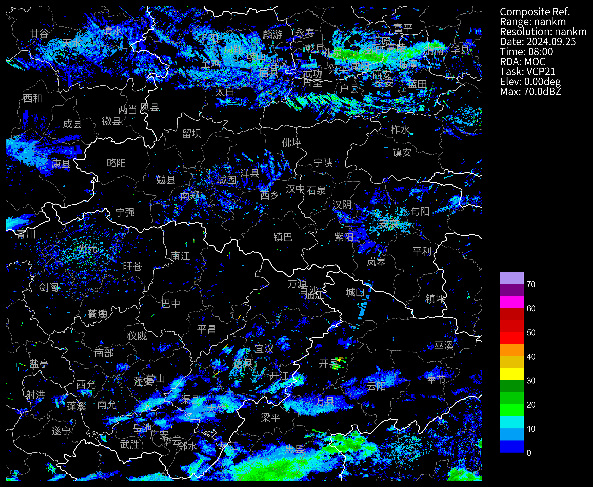
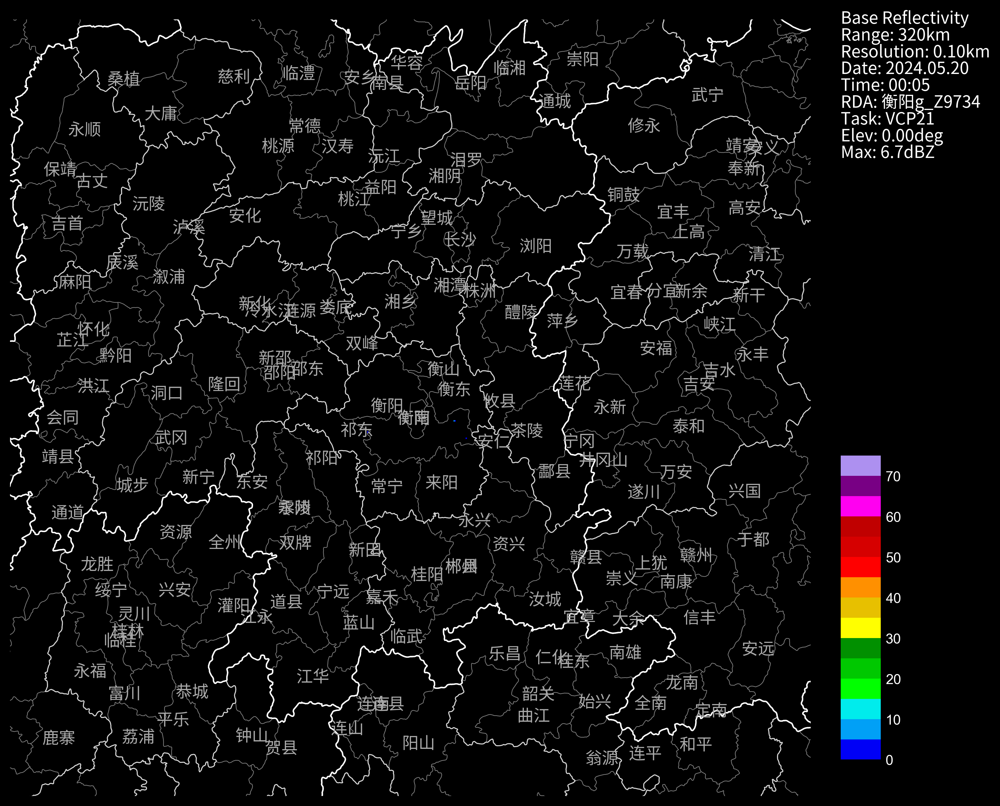

# 探测中心拼图v3.0产品
`cinrad.io.MocMosaic`支持读取探测中心拼图v3.0产品，包括拼图产品和单站产品，绝大部分类型都支持。    
需要cinrad版本>=1.9.0
## 拼图产品
```python
# MocMosaic
nFiles = (basePath+"cinrad/bz2/Z_RADA_C_BABJ_20240925080617_P_DOR_ACHN_CREF_20240925_080000.bin")
f = cinrad.io.MocMosaic(nFiles)
dt = f.get_data()
dt
```
```md
<xarray.Dataset> Size: 208MB
Dimensions:    (latitude: 4200, longitude: 6200)
Coordinates:
  * latitude   (latitude) float64 34kB 12.2 12.21 12.22 ... 54.18 54.19 54.2
  * longitude  (longitude) float64 50kB 73.0 73.01 73.02 ... 135.0 135.0 135.0
Data variables:
    CR         (latitude, longitude) float64 208MB nan nan nan ... nan nan nan
Attributes:
    scan_time:        2024-09-25 08:00:00
    site_code:        MOC
    site_name:        MOC
    tangential_reso:  nan
    range:            nan
    elevation:        0
```
```python
dt.max() # 最大的反射率
```
```md
<xarray.Dataset> Size: 8B
Dimensions:  ()
Data variables:
    CR       float64 8B 70.0
```

### CAPPI高度
如果是CAPPI产品，这个参数表示CAPPI的高度:meter
```python
f.header["height"]
```
```python
# 计算REF大于35的数量，这代表不了面积
dt["CR"].values[dt["CR"].values > 35].shape
# (21138,)
```
```python
# 画图
fig = PPI(dt, style="black", extent=[105, 110, 30, 35], add_city_names=True)
```

## 单站产品
### 产品CAPPI
```python
nFiles = "Z_RADA_C_BABJ_20240520001131_P_DOR_Z9734_CAP_20240520_000532.bin"
f = cinrad.io.MocMosaic(nFiles)
dt = f.get_data()
dt
```
```md
<xarray.Dataset> Size: 71MB
Dimensions:    (height: 24, latitude: 575, longitude: 645)
Coordinates:
  * height     (height) int64 192B 500 1000 1500 2000 ... 14000 15000 16000
  * latitude   (latitude) float64 5kB 24.06 24.07 24.08 ... 29.79 29.8 29.81
  * longitude  (longitude) float64 5kB 109.4 109.4 109.4 ... 115.8 115.8 115.8
Data variables:
    REF        (height, latitude, longitude) float64 71MB nan nan ... nan nan
Attributes:
    scan_time:        2024-05-20 00:05:00
    site_code:        Z9734
    site_name:        g_Z9734
    site_longitude:   112.0
    site_latitude:    26.0
    tangential_reso:  0.1
    range:            320
    elevation:        0
    task:             VCP21
```
### 进一步处理
发现是一个三维数据，多了个height维度，如果要画图的话，需要选择一个高度层
```python
dt0 = dt.sel(height=1500)
fig = PPI(dt0, style="black", add_city_names=True)
```


### REF数据    
```python
nFiles = "Z_RADA_C_BABJ_20221225134644_P_DOR_Z9859_CREF_20221225_135233.bin"
f = cinrad.io.MocMosaic(nFiles)
dt = f.get_data()
dt
```
```md
<xarray.Dataset> Size: 2MB
Dimensions:    (latitude: 431, longitude: 476)
Coordinates:
    height     int64 8B 0
  * latitude   (latitude) float64 3kB 22.91 22.92 22.93 ... 27.21 27.22 27.23
  * longitude  (longitude) float64 4kB 102.6 102.6 102.6 ... 107.3 107.3 107.3
Data variables:
    CR         (latitude, longitude) float64 2MB nan nan nan nan ... nan nan nan
Attributes:
    scan_time:        2022-12-25 13:46:00
    site_code:        Z9859
    site_name:        Z9859
    site_longitude:   112.0
    site_latitude:    25.0
    tangential_reso:  0.1
    range:            240
    elevation:        0
    task:             VCP21
```
