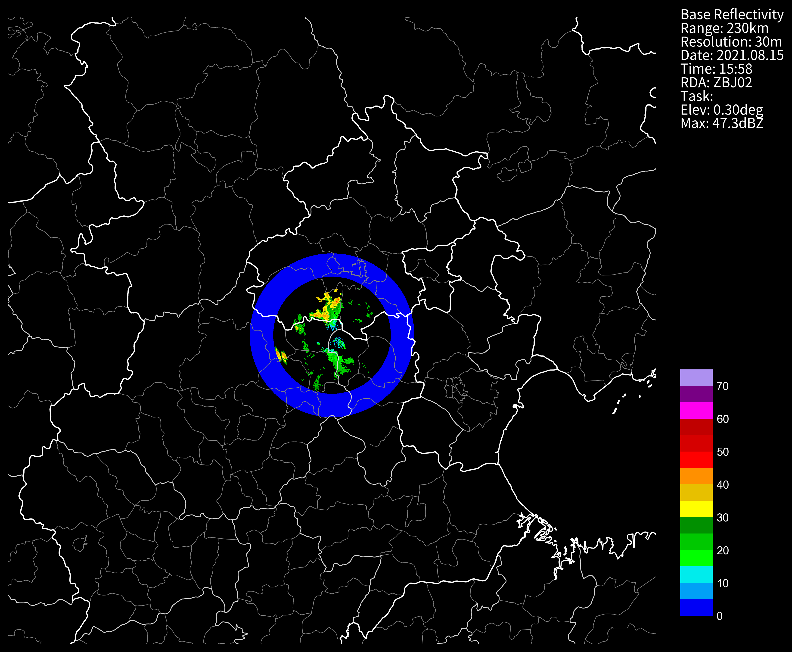
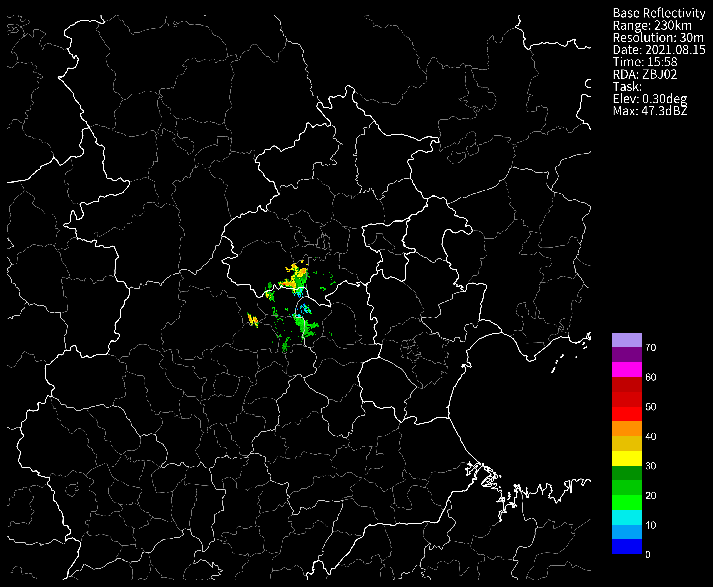
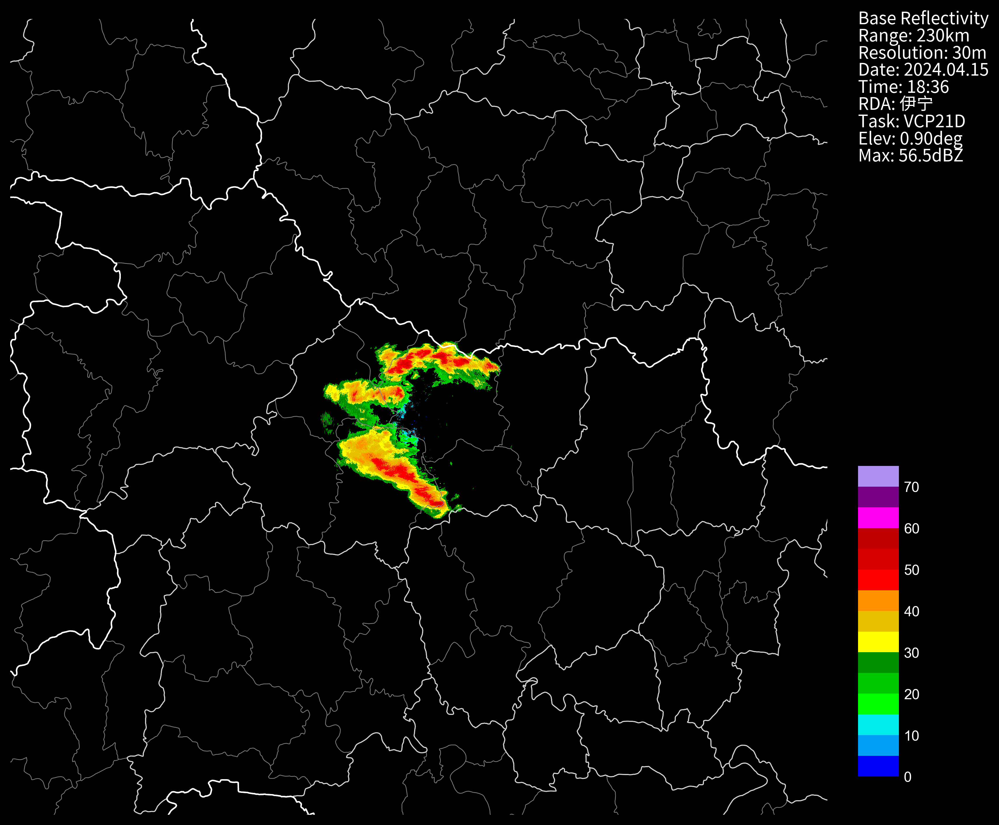

# 相控阵雷达基数据
- 请更新到最新版本 ≥ 1.9.1
- cinrad.io.PhasedArrayData 旧格式相控阵雷达基数据
- cinrad.io.StandardData 标准格式雷达基数据
## AXPT0364
```python
nFiles = "Z_RADR_I_ZS409_20231220000000_O_DOR_AXPT0364_CRA.bz2"
f = cinrad.io.read_auto(nFiles)
print(type(f).__name__)
data = f.get_data(0, 230, "RHO")
data
```
```md
StandardData # 也就是说实际上是调用的StandardData
```
```md
<xarray.Dataset> Size: 88MB
Dimensions:    (azimuth: 360, distance: 7666)
Coordinates:
  * azimuth    (azimuth) float32 1kB 0.0 0.01745 0.03491 ... 6.231 6.248 6.266
  * distance   (distance) float64 61kB 0.03 0.06 0.09 0.12 ... 229.9 229.9 230.0
Data variables:
    RHO        (azimuth, distance) float64 22MB nan nan nan nan ... nan nan nan
    longitude  (azimuth, distance) float64 22MB 112.0 112.0 ... 112.0 112.0
    latitude   (azimuth, distance) float64 22MB 32.0 32.0 32.0 ... 34.07 34.07
    height     (azimuth, distance) float64 22MB 1.12e+06 1.12e+06 ... 1.12e+06
Attributes:
    elevation:        0.9
    range:            230
    scan_time:        2023-12-20 00:00:00
    site_code:        Z9999
    site_name:        伊宁
    site_longitude:   112.0
    site_latitude:    32.0
    tangential_reso:  0.03
    nyquist_vel:      20.155872
    task:             VCP21D
```

```python
f.available_product(0)
```
```md
['TREF', 'REF', 'VEL', 'SW', 'ZDR', 'PHI', 'KDP', 'RHO', 'SNRH', 'SQI']
```
```python
str(f.el) # 这仰角也太多了吧~
```
```md
'[0.9, 1.8, 2.7, 3.6, 4.5, 5.4, 6.3, 7.2, 8.1, 9.0, 9.9, 10.8, 11.7, 12.6, 13.5, 14.4, 15.3, 16.2, 17.1, 18.0, 18.9, 19.8, 20.7, 21.6, 22.5, 23.4, 24.3, 25.2, 26.1, 27.0, 27.9, 28.8, 29.7, 30.6, 31.5, 32.4, 33.3, 34.2, 35.1, 36.0]'
```
```python
str(f.available_tilt('REF')) #REF产品有哪些仰角可以读取
```
```md
'[0, 1, 2, 3, 4, 5, 6, 7, 8, 9, 10, 11, 12, 13, 14, 15, 16, 17, 18, 19, 20, 21, 22, 23, 24, 25, 26, 27, 28, 29, 30, 31, 32, 33, 34, 35, 36, 37, 38, 39]'
```
## 老格式相控阵 DXK
```python
nFiles = "Z_RADR_I_ZBJ02_20210815155836_O_DOR_DXK_CAR.bin"
f = cinrad.io.read_auto(nFiles)
print(type(f).__name__)
data = f.get_data(0, 230, "REF")
data.REF
```
```md
PhasedArrayData # 单独接口
```
```md
<xarray.DataArray 'REF' (azimuth: 360, distance: 7666)> Size: 22MB
array([[nan, nan, nan, ..., nan, nan, nan],
       [nan, nan, nan, ..., nan, nan, nan],
       [nan, nan, nan, ..., nan, nan, nan],
       ...,
       [nan, nan, nan, ..., nan, nan, nan],
       [nan, nan, nan, ..., nan, nan, nan],
       [nan, nan, nan, ..., nan, nan, nan]])
Coordinates:
  * azimuth   (azimuth) float64 3kB 0.0 0.01745 0.0349 ... 6.231 6.248 6.266
  * distance  (distance) float64 61kB 0.03 0.06 0.09 0.12 ... 229.9 229.9 230.0
```
以下方法和`StandardData`一致
```python
f.available_product(0)
```
```md
['TREF', 'REF', 'VEL', 'SW', 'ZDR', 'PHI', 'KDP', 'RHO']
```
```python
f.el
```
```md
array([0.29663539, 0.79652094, 1.2964065 , 1.79629206, 2.29617762,
       2.79606317, 3.29594873, 3.79583429])
```
```python
fig = cinrad.visualize.PPI(data, style="black")
```



屏蔽0DBZ以下的回波
```python
# dbz<=0 的会在画图的时候有一个圈，修改为nan即可
import numpy as np
data["REF"].values = np.ma.masked_less(data["REF"].values, 0)
fig = cinrad.visualize.PPI(data, style="black")
```

## AXPT0364_FMT
AXPT貌似都是标准格式的
```python
nFiles = "Z_RADR_I_ZA601_20240415183600_O_DOR_AXPT0364_CRA_FMT.bin.bz2"
f = cinrad.io.read_auto(nFiles)
print(type(f).__name__)
data = f.get_data(0, 230, "REF")
data
```
```md
StandardData
```
```md
<xarray.Dataset> Size: 88MB
Dimensions:    (azimuth: 360, distance: 7666)
Coordinates:
  * azimuth    (azimuth) float32 1kB 0.0 0.01745 0.03491 ... 6.231 6.248 6.266
  * distance   (distance) float64 61kB 0.03 0.06 0.09 0.12 ... 229.9 229.9 230.0
Data variables:
    REF        (azimuth, distance) float64 22MB nan nan nan nan ... nan nan nan
    longitude  (azimuth, distance) float64 22MB 112.0 112.0 ... 112.0 112.0
    latitude   (azimuth, distance) float64 22MB 32.0 32.0 32.0 ... 34.07 34.07
    height     (azimuth, distance) float64 22MB 1.12e+06 1.12e+06 ... 1.12e+06
Attributes:
    elevation:        0.9
    range:            230
    scan_time:        2024-04-15 18:36:00
    site_code:        Z9999
    site_name:        伊宁
    site_longitude:   112.0
    site_latitude:    32.0
    tangential_reso:  0.03
    nyquist_vel:      19.746197
    task:             VCP21D
```
```python
fig = cinrad.visualize.PPI(data, style="black")
```

