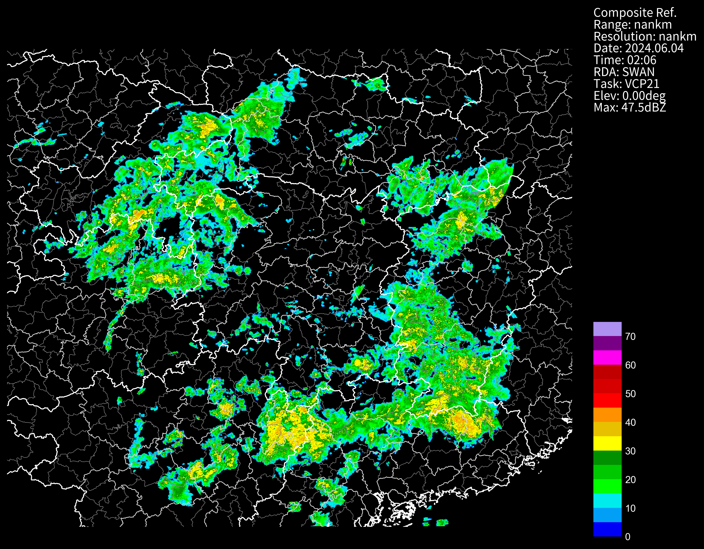

# SWAN3产品
- cinrad.io.SWAN(file, product)接口用于读取SWAN3产品，例如CR、COTREC风场等。
  * file: 文件路径
  * prduct: 产品类型，例如`CR`。部分文件内产品类型是乱码或者不正确时，可以输入此参数来指定。
## 三维拼图 MOSAIC
也就是多层CR拼图
```python
nFiles = basePath + "/cinrad/bz2/Z_OTHE_RADAMOSAIC_20240604020600.bin.bz2"
f = cinrad.io.SWAN(nFiles, product="CR")
data = f.get_data()
data
```
```md
<xarray.Dataset> Size: 241MB
Dimensions:    (height: 21, latitude: 1101, longitude: 1301)
Coordinates:
  * height     (height) float32 84B 0.5 1.0 1.5 2.0 2.5 ... 14.0 15.5 17.0 19.0
  * latitude   (latitude) float32 4kB 33.0 32.99 32.98 ... 22.01 22.0 21.99
  * longitude  (longitude) float32 5kB 105.0 105.0 105.0 ... 118.0 118.0 118.0
Data variables:
    CR         (height, latitude, longitude) float64 241MB nan nan ... nan nan
Attributes:
    scan_time:        2024-06-04 02:06:00
    site_code:        SWAN
    site_name:        SWAN
    tangential_reso:  nan
    range:            nan
    elevation:        0
```
将CR小于0的值屏蔽
```python
data["CR"].values = np.ma.masked_less(data["CR"].values, 0)
```
选择高度为5.0的数据
```python
dt_1 = data.sel(height=5.0)
dt_1
```
```md
<xarray.Dataset> Size: 11MB
Dimensions:    (latitude: 1101, longitude: 1301)
Coordinates:
    height     float32 4B 5.0
  * latitude   (latitude) float32 4kB 33.0 32.99 32.98 ... 22.01 22.0 21.99
  * longitude  (longitude) float32 5kB 105.0 105.0 105.0 ... 118.0 118.0 118.0
Data variables:
    CR         (latitude, longitude) float64 11MB nan nan nan ... nan nan nan
Attributes:
    scan_time:        2024-06-04 02:06:00
    site_code:        SWAN
    site_name:        SWAN
    tangential_reso:  nan
    range:            nan
    elevation:        0
```
```python
fig = PPI(dt_1, style="black")
```


## 拼图 CR
```python
nFiles = basePath + "/cinrad/bz2/Z_OTHE_RADAMCR_20220525085400.bin.bz2"
f = cinrad.io.SWAN(nFiles)
data = f.get_data()
data
```
```md
<xarray.Dataset> Size: 3MB
Dimensions:    (latitude: 550, longitude: 750)
Coordinates:
    height     float32 4B 0.0
  * latitude   (latitude) float32 2kB 29.5 29.49 29.48 ... 24.02 24.01 24.0
  * longitude  (longitude) float32 3kB 103.0 103.0 103.0 ... 110.5 110.5 110.5
Data variables:
    CR         (latitude, longitude) float64 3MB nan nan nan nan ... nan nan nan
Attributes:
    scan_time:        2022-05-25 08:54:00
    site_code:        SWAN
    site_name:        SWAN
    tangential_reso:  nan
    range:            nan
    elevation:        0
```
## COTREC风场
不支持画图
```python
nFiles = basePath + "/cinrad/bz2/Z_TREC_20240520233600.BIN.BZ2"
f = cinrad.io.SWAN(nFiles,product="TREC")
data = f.get_data()
data
```
```md
<xarray.Dataset> Size: 179kB
Dimensions:    (latitude: 137, longitude: 162)
Coordinates:
    height     float32 4B 1.0
  * latitude   (latitude) float32 548B 33.0 32.92 32.84 ... 22.15 22.07 21.99
  * longitude  (longitude) float32 648B 105.0 105.1 105.2 ... 117.8 117.9 118.0
Data variables:
    TREC       (latitude, longitude) float64 178kB nan nan nan ... nan nan nan
Attributes:
    scan_time:        2024-05-20 23:36:00
    site_code:        SWAN
    site_name:        SWAN
    tangential_reso:  nan
    range:            nan
    elevation:        0
```
## ET/VIL/VILD/QPE
这几个数据都是扩大了10倍存储的，读取后记得除以10
```python
nFiles = basePath + "/cinrad/bz2/Z_OTHE_RADAMTOP_20240604014800.BIN.BZ2"
f = cinrad.io.SWAN(nFiles, product="ET")
data = f.get_data()
data = data / 10
data.max()
# fig = PPI(data, add_city_names=True, dpi=300, style="black")
```
```md
<xarray.Dataset> Size: 12B
Dimensions:  ()
Coordinates:
    height   float32 4B 0.0
Data variables:
    ET       float64 8B 17.0
```
