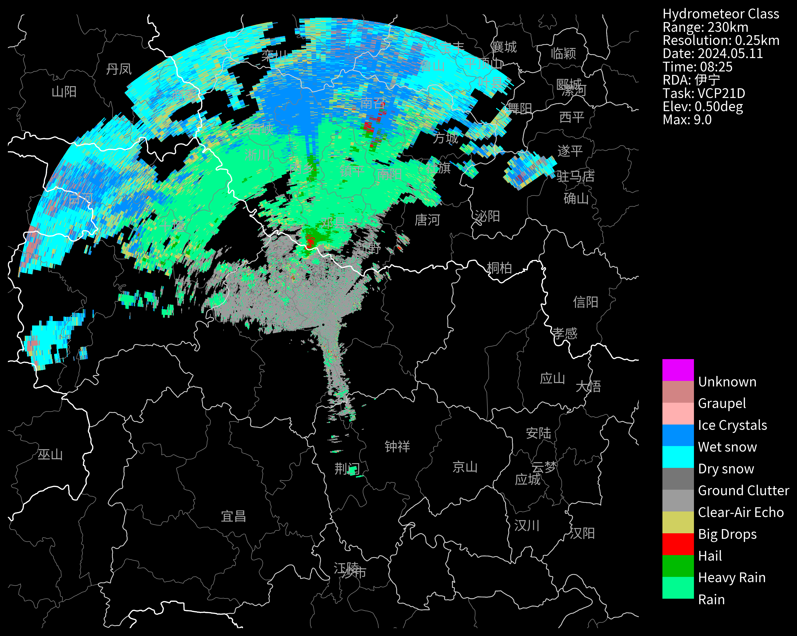
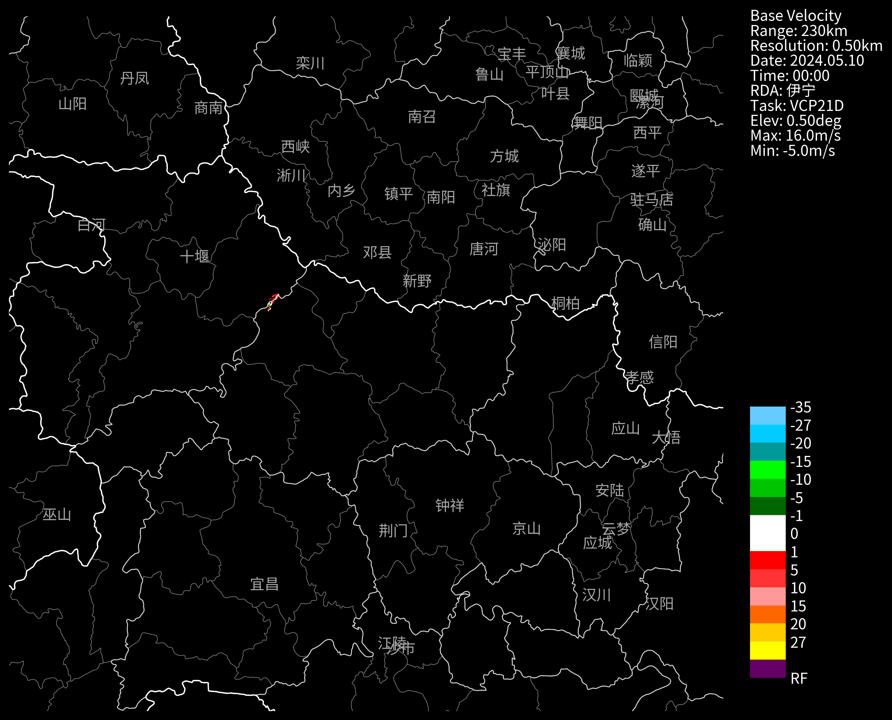
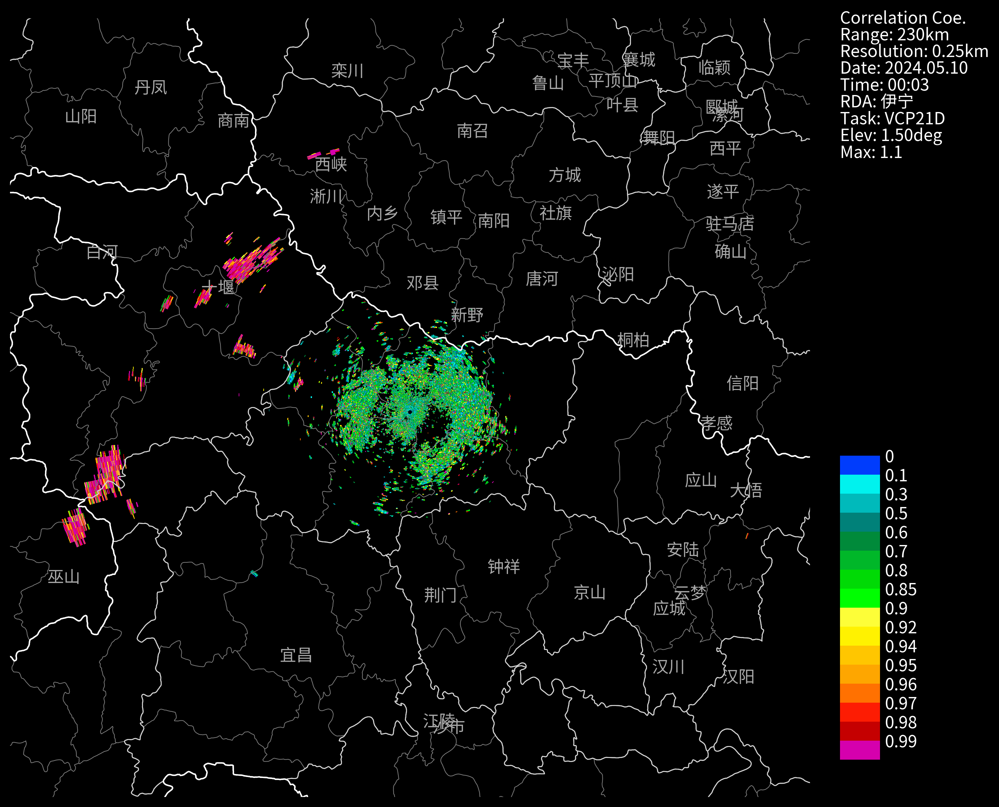
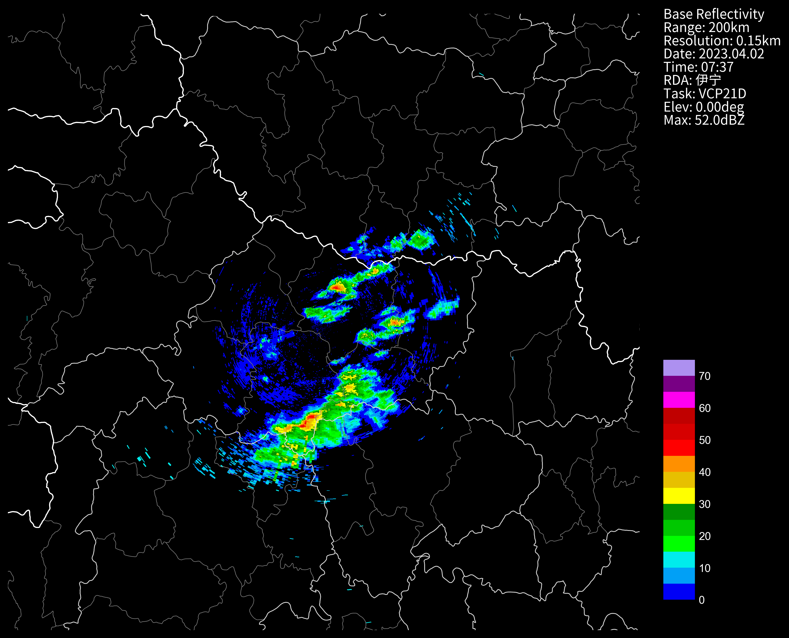
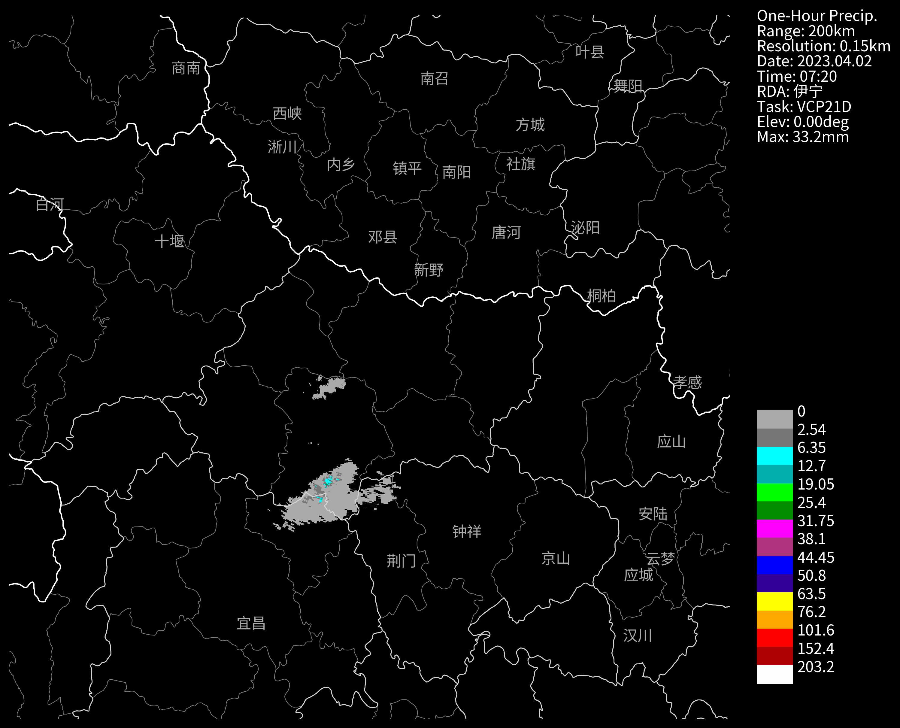
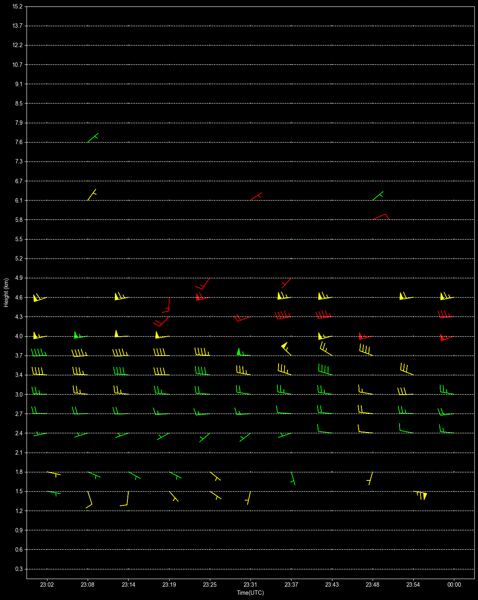

# 标准格式产品ROSE2.0
`cinrad.io.StandardPUP`支持绝大部分ROSE_PUP的产品文件读取。
- 已测试支持的产品：HCL、HI、V、MAX、HSR、WER、STI、CC、KDP、PDP、R、ZDR、CR、M、OHP、CAR、DOHP、DSTP、STP、VIL、SRM、THP、TVS、ET、VWP、DTHP、UAM、SWP、CAPPI
- 已测试不支持的产品：ML、SS、CS    

## BR产品
```python
nFiles = basePath + "/cinrad/bz2/Z_RADR_I_Z9094_20230402071419_P_DOR_CAD_R_300_400_5_FMT.bin"
f = cinrad.io.read_auto(nFiles)
dt = f.get_data()
dt
```
```md
<xarray.Dataset> Size: 16MB
Dimensions:    (azimuth: 365, distance: 1333)
Coordinates:
  * azimuth    (azimuth) float64 3kB 6.277 0.01089 0.02815 ... 6.242 6.26 6.277
  * distance   (distance) float64 11kB 0.3 0.6 0.9 1.2 ... 399.3 399.6 399.9
Data variables:
    Zc         (azimuth, distance) float64 4MB nan nan nan nan ... nan nan nan
    longitude  (azimuth, distance) float64 4MB 112.0 112.0 112.0 ... 112.0 112.0
    latitude   (azimuth, distance) float64 4MB 32.0 32.01 32.01 ... 35.6 35.6
    height     (azimuth, distance) float64 4MB 1.12e+06 1.12e+06 ... 1.12e+06
Attributes:
    elevation:        0.5
    range:            399.9
    scan_time:        2023-04-02 07:14:19
    site_code:        Z9999
    site_name:        伊宁
    site_longitude:   112.0
    site_latitude:    32.0
    tangential_reso:  0.3
    task:             VCP21D
```
## CR产品
```python
nFiles = basePath + "/cinrad/bz2/Z_RADR_I_Z9730_20240510000142_P_DOR_SB_CR_250X250_230_NUL_FMT.bin"
f = cinrad.io.read_auto(nFiles)
dt = f.get_data()
dt
```
```md
<xarray.Dataset> Size: 27MB
Dimensions:    (latitude: 1840, longitude: 1840)
Coordinates:
  * latitude   (latitude) float64 15kB 34.07 34.07 34.07 ... 29.93 29.93 29.93
  * longitude  (longitude) float64 15kB 109.5 109.5 109.5 ... 114.4 114.4 114.4
Data variables:
    CR         (latitude, longitude) float64 27MB nan nan nan ... nan nan nan
Attributes:
    elevation:        0
    range:            230
    scan_time:        2024-05-10 00:01:42
    site_code:        Z9999
    site_name:        伊宁
    site_longitude:   112.0
    site_latitude:    32.0
    tangential_reso:  0.25
```
## MAX产品
这个产品实际上读取出来只能看到`俯视最大数据投影区`的数据，因为只读取了1遍。
```python
nFiles = basePath + "/cinrad/bz2/Z_RADR_I_ZN701_20230805000000_P_DOR_YLD2-D_CR_150X150_230_NUL_FMT.bin.bz2"
f = cinrad.io.read_auto(nFiles)
data = f.get_data()

data
```
```md
<xarray.Dataset> Size: 8MB
Dimensions:    (latitude: 1000, longitude: 1000)
Coordinates:
  * latitude   (latitude) float64 8kB 32.68 32.67 32.67 ... 31.33 31.33 31.32
  * longitude  (longitude) float64 8kB 111.2 111.2 111.2 ... 112.8 112.8 112.8
Data variables:
    MAX        (latitude, longitude) float64 8MB 11.5 13.0 12.5 ... nan nan nan
Attributes:
    elevation:        0
    range:            75
    scan_time:        2023-08-05 00:00:24
    site_code:        Z9999
    site_name:        伊宁
    site_longitude:   112.0
    site_latitude:    32.0
    tangential_reso:  0.15
```
## WER产品
```python
nFiles = basePath + "/cinrad/bz2/Z_RADR_I_Z9731_20240519000105_P_DOR_SAD_WER_250_50X50_NUL_FMT.bin"
f= cinrad.io.read_auto(nFiles)
data = f.get_data()

data
```
```md
<xarray.Dataset> Size: 3MB
Dimensions:    (latitude: 200, longitude: 200)
Coordinates:
  * latitude   (latitude) float64 2kB 32.23 32.22 32.22 ... 31.78 31.78 31.77
  * longitude  (longitude) float64 2kB 111.7 111.7 111.7 ... 112.3 112.3 112.3
Data variables:
    WER_0.5    (latitude, longitude) float64 320kB nan nan 2.5 ... nan -3.0 nan
    WER_1.5    (latitude, longitude) float64 320kB nan nan nan ... nan nan nan
    WER_2.4    (latitude, longitude) float64 320kB 10.0 10.0 8.5 ... nan nan nan
    WER_3.4    (latitude, longitude) float64 320kB 23.5 23.5 20.5 ... nan nan
    WER_4.3    (latitude, longitude) float64 320kB 20.5 20.5 18.5 ... nan nan
    WER_6.0    (latitude, longitude) float64 320kB 6.0 6.0 5.5 ... nan nan nan
    WER_9.9    (latitude, longitude) float64 320kB nan nan -3.0 ... nan nan nan
    WER_14.6   (latitude, longitude) float64 320kB nan nan nan ... nan nan nan
Attributes:
    elevation:        0
    range:            25
    scan_time:        2024-05-19 00:01:05
    site_code:        Z9999
    site_name:        伊宁
    site_longitude:   112.0
    site_latitude:    32.0
    tangential_reso:  0.25
    center_height:    621
```

## HCL产品
```python
nFiles = basePath + "/cinrad/bz2/Z_RADR_I_Z9735_20240511082558_P_DOR_SAD_HCL_250_230_5_FMT.bin"
f = cinrad.io.read_auto(nFiles)
hcl = f.get_data()
print(hcl)
fig = cinrad.visualize.PPI(hcl, add_city_names=True, dpi=300, style="black")
```
```md
<xarray.Dataset> Size: 11MB
Dimensions:    (azimuth: 360, distance: 920)
Coordinates:
  * azimuth    (azimuth) float64 3kB 0.0 0.0175 0.035 ... 6.248 6.266 6.283
  * distance   (distance) float64 7kB 0.25 0.5 0.75 1.0 ... 229.5 229.8 230.0
Data variables:
    HCL        (azimuth, distance) float64 3MB nan nan nan 4.0 ... 6.0 6.0 6.0
    longitude  (azimuth, distance) float64 3MB 112.0 112.0 112.0 ... 112.0 112.0
    latitude   (azimuth, distance) float64 3MB 32.0 32.0 32.01 ... 34.07 34.07
    height     (azimuth, distance) float64 3MB 1.12e+06 1.12e+06 ... 1.12e+06
Attributes:
    elevation:        0.5
    range:            230.0
    scan_time:        2024-05-11 08:25:58
    site_code:        Z9999
    site_name:        伊宁
    site_longitude:   112.0
    site_latitude:    32.0
    tangential_reso:  0.25
    task:             VCP21D
```

## STI产品
这是目前为止，唯一一个返回JSON数据的接口。
```python
# rose sti
import json
import numpy as np

# 用于json序列化numpy数据，确保前端可以正常解析
class NumpyEncoder(json.JSONEncoder):
    def default(self, obj):
        if isinstance(obj, np.float32):
            return float(obj)
        elif isinstance(obj, np.int32):
            return float(obj)
        return json.JSONEncoder.default(self, obj)


f = cinrad.io.read_auto(basePath+'cinrad/bz2/Z9737_20230424171836Z_STI_00_58')
data = f.get_data()
js = json.dumps(data, cls = NumpyEncoder)
js
```
```python
{
    "data": [
        {
            "id": "217",
            "current_position": [
                111.7,
                28.0
            ],
            "current_speed": 21.4,
            "current_direction": 260.35,
            "forecast_position": [
                [
                    111.9,
                    28.1
                ],
                [
                    112.0,
                    28.1
                ]
            ],
            "history_position": [
                [
                    111.6,
                    28.0
                ],
                [
                    111.5,
                    28.0
                ]
            ],
            "max_ref": 51.0,
            "max_ref_height": 1587.0,
            "vil": 13.26,
            "top_height": 5585.0
        }
    ],
    "attrs": {
        "scan_time": "2023-04-24 17:18:36",
        "site_code": "Z9737",
        "site_name": "益阳",
        "site_longitude": 199,
        "site_latitude": 99,
        "task": "VCP21",
        "sti_count": 64.0
    }
}
```
## UAM产品
```python
nFiles = basePath + "/cinrad/bz2/Z9737_20231128135254Z_UAM_00_hail"
f = cinrad.io.read_auto(nFiles)
dt = f.get_data()

dt
```
```md
<xarray.Dataset> Size: 0B
Dimensions:    (dim_0: 0)
Dimensions without coordinates: dim_0
Data variables:
    a          (dim_0) int32 0B 
    b          (dim_0) int32 0B 
    deg        (dim_0) int32 0B 
    longitude  (dim_0) float64 0B 
    latitude   (dim_0) float64 0B 
Attributes:
    scan_time:       2023-11-28 13:52:54
    site_code:       Z9999
    site_name:       伊宁
    site_longitude:  112.0
    site_latitude:   32.0
    task:            VCP21
```
## VEL速度产品
```python
nFiles = basePath + "/cinrad/bz2/Z_RADR_I_Z9735_20240510000045_P_DOR_SAD_V_500_230_5_FMT.bin"
f = cinrad.io.read_auto(nFiles)
dt = f.get_data()
print(dt)
dt = dt.rename({'Vc': 'VEL'})
fig = PPI(dt, add_city_names=True, dpi=300, style="black")
```
```md
<xarray.Dataset> Size: 5MB
Dimensions:    (azimuth: 357, distance: 460)
Coordinates:
  * azimuth    (azimuth) float64 3kB 0.002444 0.02009 0.03774 ... 6.268 0.002444
  * distance   (distance) float64 4kB 0.5 1.0 1.5 2.0 ... 229.0 229.5 230.0
Data variables:
    Vc         (azimuth, distance) float64 1MB nan nan nan nan ... nan nan nan
    longitude  (azimuth, distance) float64 1MB 112.0 112.0 112.0 ... 112.0 112.0
    latitude   (azimuth, distance) float64 1MB 32.0 32.01 32.01 ... 34.07 34.07
    height     (azimuth, distance) float64 1MB 1.12e+06 1.12e+06 ... 1.12e+06
Attributes:
    elevation:        0.5
    range:            230.0
    scan_time:        2024-05-10 00:00:45
    site_code:        Z9999
    site_name:        伊宁
    site_longitude:   112.0
    site_latitude:    32.0
    tangential_reso:  0.5
    task:             VCP21D
```

## ZDR产品
```python
nFiles = basePath + "/cinrad/bz2/Z_RADR_I_Z9743_20240510000107_P_DOR_SAD_ZDR_250_230_5_FMT.bin"
f = cinrad.io.read_auto(nFiles)
dt = f.get_data()
dt
```
```md
<xarray.Dataset> Size: 11MB
Dimensions:    (azimuth: 365, distance: 920)
Coordinates:
  * azimuth    (azimuth) float64 3kB 0.007243 0.0245 0.04177 ... 6.273 0.007243
  * distance   (distance) float64 7kB 0.25 0.5 0.75 1.0 ... 229.5 229.8 230.0
Data variables:
    ZDRc       (azimuth, distance) float64 3MB nan nan nan nan ... nan nan nan
    longitude  (azimuth, distance) float64 3MB 112.0 112.0 112.0 ... 112.0 112.0
    latitude   (azimuth, distance) float64 3MB 32.0 32.0 32.01 ... 34.07 34.07
    height     (azimuth, distance) float64 3MB 1.12e+06 1.12e+06 ... 1.12e+06
Attributes:
    elevation:        0.5
    range:            230.0
    scan_time:        2024-05-10 00:01:07
    site_code:        Z9999
    site_name:        伊宁
    site_longitude:   112.0
    site_latitude:    32.0
    tangential_reso:  0.25
    task:             VCP21D
```
## CC产品
```python
nFiles = basePath + "/cinrad/bz2/Z_RADR_I_Z9739_20240510000327_P_DOR_SAD_CC_250_230_15_FMT.bin"
f = cinrad.io.read_auto(nFiles)
dt = f.get_data()
print(dt)
fig = PPI(dt, add_city_names=True, dpi=300, style="black")
```
```md
<xarray.Dataset> Size: 11MB
Dimensions:    (azimuth: 366, distance: 920)
Coordinates:
  * azimuth    (azimuth) float64 3kB 0.005061 0.02228 0.03949 ... 6.271 0.005061
  * distance   (distance) float64 7kB 0.25 0.5 0.75 1.0 ... 229.5 229.8 230.0
Data variables:
    RHO        (azimuth, distance) float64 3MB nan nan nan nan ... nan nan nan
    longitude  (azimuth, distance) float64 3MB 112.0 112.0 112.0 ... 112.0 112.0
    latitude   (azimuth, distance) float64 3MB 32.0 32.0 32.01 ... 34.07 34.07
    height     (azimuth, distance) float64 3MB 1.12e+06 1.12e+06 ... 1.12e+06
Attributes:
    elevation:        1.5
    range:            230.0
    scan_time:        2024-05-10 00:03:27
    site_code:        Z9999
    site_name:        伊宁
    site_longitude:   112.0
    site_latitude:    32.0
    tangential_reso:  0.25
    task:             VCP21D
```

## CAPPI产品
cinrad目前不支持计算CAPPI，这里指的是ROSE生成的产品
```python
nFiles = basePath + "/cinrad/bz2/Z_RADR_I_Z9094_20230402073754_P_DOR_CAD_CAR_150_200_NUL_FMT.bin"
f = cinrad.io.read_auto(nFiles)
print(type(f).__name__)
dt = f.get_data()
dt
```
```md
StandardPUP
```
```md
<xarray.Dataset> Size: 12MB
Dimensions:    (height: 1, azimuth: 360, distance: 1333)
Coordinates:
  * height     (height) float64 8B 3e+03
  * azimuth    (azimuth) float64 3kB 0.0 0.0175 0.035 ... 6.248 6.266 6.283
  * distance   (distance) float64 11kB 0.15 0.3 0.45 0.6 ... 199.7 199.8 199.9
Data variables:
    CAPPI      (height, azimuth, distance) float64 4MB nan nan nan ... nan nan
    longitude  (azimuth, distance) float64 4MB 112.0 112.0 112.0 ... 112.0 112.0
    latitude   (azimuth, distance) float64 4MB 32.0 32.0 32.0 ... 33.8 33.8 33.8
Attributes:
    elevation:        0
    range:            199.95
    scan_time:        2023-04-02 07:37:54
    site_code:        Z9999
    site_name:        伊宁
    site_longitude:   112.0
    site_latitude:    32.0
    tangential_reso:  0.15
    task:             VCP21D
```
```python
# CAPPI是可以多层的，因此画图前需要将height维度降维
dt0 = dt.sel(height=dt.coords["height"][0])
# 还得重命名变量，因为CAPPI的变量名是CAPPI，而不是REF
dt0 = dt0.rename({"CAPPI":"REF"})
fig = cinrad.visualize.PPI(dt0)
```

## HI产品
```python
nFiles = basePath + "/cinrad/bz2/Z_RADR_I_Z9094_20230402070825_P_DOR_CAD_HI_NUL_200_NUL_FMT.bin"
f = cinrad.io.read_auto(nFiles)
data = f.get_data()
data
```
```md
<xarray.Dataset> Size: 56B
Dimensions:                  (dim_0: 2)
Dimensions without coordinates: dim_0
Data variables:
    hail_possibility         (dim_0) int32 8B 20 0
    hail_size                (dim_0) float32 8B 0.3918 0.0
    hail_severe_possibility  (dim_0) int32 8B 0 0
    longitude                (dim_0) float64 16B 111.7 111.6
    latitude                 (dim_0) float64 16B 31.41 31.32
Attributes:
    scan_time:       2023-04-02 07:08:25
    site_code:       Z9999
    site_name:       伊宁
    site_longitude:  112.0
    site_latitude:   32.0
    task:            VCP21D
    height_0deg:     3.2003999
    height_-20deg:   6.0959997
```
## OHP产品
```python
nFiles = basePath + "/cinrad/bz2/Z_RADR_I_Z9094_20230402072013_P_DOR_CAD_OHP_150_200_NUL_FMT.bin"
f = cinrad.io.read_auto(nFiles)
data = f.get_data()
data
```
```md
<xarray.Dataset> Size: 15MB
Dimensions:    (azimuth: 360, distance: 1333)
Coordinates:
  * azimuth    (azimuth) float64 3kB 0.0 0.0175 0.035 ... 6.248 6.266 6.283
  * distance   (distance) float64 11kB 0.15 0.3 0.45 0.6 ... 199.7 199.8 199.9
Data variables:
    OHP        (azimuth, distance) float64 4MB nan nan nan nan ... nan nan nan
    longitude  (azimuth, distance) float64 4MB 112.0 112.0 112.0 ... 112.0 112.0
    latitude   (azimuth, distance) float64 4MB 32.0 32.0 32.0 ... 33.8 33.8 33.8
    height     (azimuth, distance) float64 4MB 1.12e+06 1.12e+06 ... 1.12e+06
Attributes:
    elevation:        0
    range:            199.95
    scan_time:        2023-04-02 07:20:13
    site_code:        Z9999
    site_name:        伊宁
    site_longitude:   112.0
    site_latitude:    32.0
    tangential_reso:  0.15
    task:             VCP21D
```
```python
fig = PPI(data, add_city_names=True, dpi=300, style="black")
```

## VWP产品
```python
# 读取VWP
import warnings
import cinrad 
import numpy as np

warnings.filterwarnings("ignore")
nFiles = "d:/temp/cinrad/bz2/Z_RADR_I_Z9731_20240126000025_P_DOR_SAD_VWP_NUL_NUL_NUL_FMT.bin"
f = cinrad.io.read_auto(nFiles)
vwp = f.get_data()

# 有部分雷达的产品输出时，风速有小于0的情况，需要过滤掉
# vwp.wind_speed.values = np.ma.masked_less(vwp.wind_speed.values, 0.0)
# vwp.wind_speed.values = np.round(vwp.wind_speed.values, 2)
vwp
```
```md
<xarray.Dataset> Size: 8kB
Dimensions:         (times: 11, height: 30)
Coordinates:
  * times           (times) int32 44B 1706223749 1706224097 ... 1706227225
  * height          (height) int32 120B 300 600 900 1200 ... 12200 13700 15200
Data variables:
    wind_direction  (times, height) float64 3kB 0.0 0.0 0.0 ... 89.0 11.0 0.0
    wind_speed      (times, height) float64 3kB 0.0 0.0 0.0 ... 0.35 1.04 0.0
    rms             (times, height) float64 3kB 0.0 0.0 0.0 ... 0.57 0.73 0.0
Attributes:
    scan_time:       2024-01-26 00:00:25
    site_code:       Z9999
    site_name:       伊宁
    site_longitude:  112.0
    site_latitude:   32.0
    task:            VCP21D
```
### VWP 画图
```python
import numpy as np
import matplotlib.pyplot as plt
import xarray
import datetime

height = np.round(np.array(vwp.height) / 1000, 1)
times = np.array(vwp.times)
times = [datetime.datetime.fromtimestamp(time, datetime.timezone.utc) for time in times]
times = [time.strftime("%H:%M") for time in times]
wind_direction = vwp.wind_direction
wind_speed = vwp.wind_speed
rms = vwp.rms
u = -wind_speed * np.sin(np.radians(wind_direction))
v = -wind_speed * np.cos(np.radians(wind_direction))


def _get_vwp_color(rms: xarray.DataArray) -> list:
    """
    风羽的颜色是由RMS值决定的。
    """
    data = rms.data
    color_map = [
        (0, "#00FF00"),
        (2, "#FFFF00"),
        (4, "#FF0000"),
        (6, "#00EFFF"),
        (8, "#FF7BFF"),
        (10, "#FFFFFF"),
    ]

    color = []
    for value in data:
        cr = color_map[0][1]
        for i in range(len(color_map)):
            if value > color_map[i][0]:
                cr = color_map[i][1]
        color.append(cr)
    return color


fig, ax = plt.subplots(1, 1, figsize=(12, 15))
ax.set_xlabel("Time(UTC)")
plt.style.use("dark_background")
ax.set_ylabel("Height (km)")
nums = np.arange(1, 31, dtype=int)
ax.set_yticks(nums, labels=height)
plt.ylim((0.5, 30))
plt.grid(True, which="both", axis="y", linestyle="--")
for i in range(len(times)):
    x = [times[i] for _ in range(len(height))]
    colors = _get_vwp_color(rms[i])
    ax.barbs(
        x,
        nums,
        u[i],
        v[i],
        rounding=False,
        barb_increments=dict(half=2, full=4, flag=20),
        sizes=dict(emptybarb=0.01, spacing=0.23, height=0.5, width=0.25),
        color=colors,
    )
plt.tight_layout()
```

