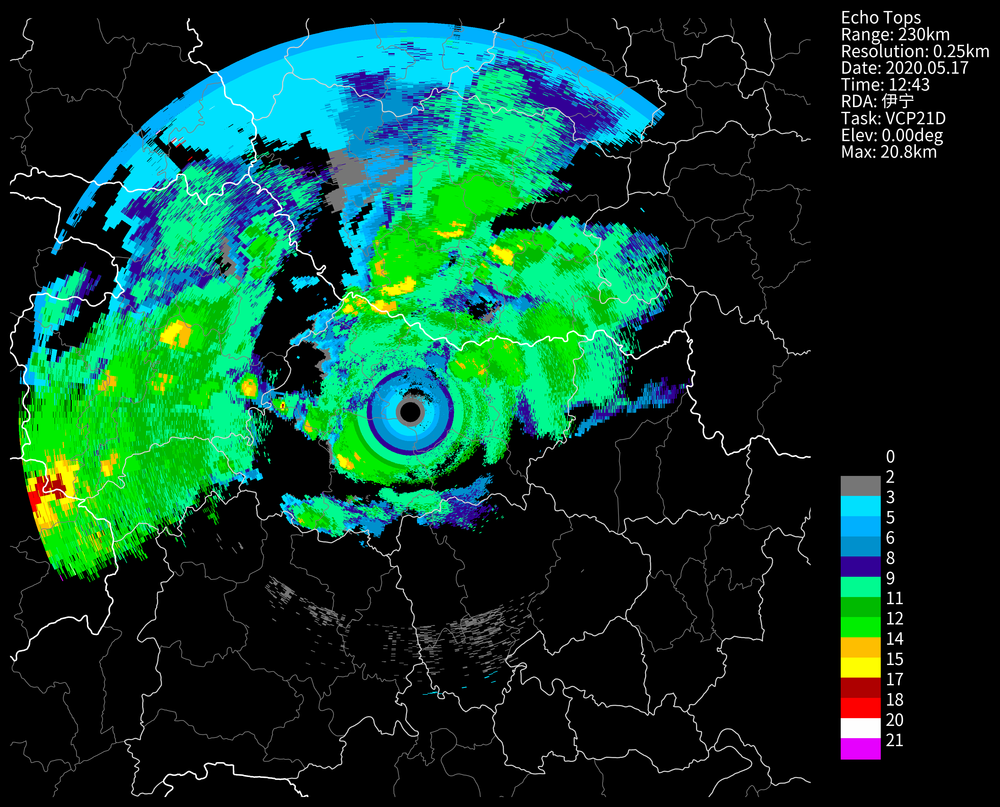

# 计算接口
提供雷达衍生产品的计算，`cinrad.calc`模块提供了一些常用的计算接口，例如：CR、ET、VIL、VILD、HCL等
|接口|数据类型|
|:-:|:-:|
|quick_cr|CR|
|quick_et|ET|
|quick_vil|vil|
|quick_vild|vild|
|hydro_class|HCL|
|quick_cappi|遥遥无期ing☕|

## 计算CR
```python
r_list = list(f.iter_tilt(230, 'REF'))
cr = cinrad.calc.quick_cr(r_list, resolution=(1000,1000)) # resolution(tuple): 经纬度的个数长度，可选。
cr
```
```md
<xarray.Dataset> Size: 8MB
Dimensions:    (latitude: 1000, longitude: 1000)
Coordinates:
  * latitude   (latitude) float64 8kB 29.93 29.93 29.94 ... 34.06 34.07 34.07
  * longitude  (longitude) float64 8kB 109.6 109.6 109.6 ... 114.4 114.4 114.4
Data variables:
    CR         (latitude, longitude) float64 8MB nan nan nan nan ... nan nan nan
Attributes:
    elevation:        0
    range:            230
    scan_time:        2020-05-17 12:43:00
    site_code:        Z9999
    site_name:        伊宁
    site_longitude:   112.0
    site_latitude:    32.0
    tangential_reso:  0.25
    nyquist_vel:      30.728043
    task:             VCP21D
```
```python
# 选择一个点的CR大小,例如(30.0,120.0)
cr.sel(latitude=30.0,longitude=120.0,method="nearest")
```
```md
<xarray.Dataset> Size: 24B
Dimensions:    ()
Coordinates:
    latitude   float64 8B 30.0
    longitude  float64 8B 114.4
Data variables:
    CR         float64 8B nan
Attributes:
    elevation:        0
    range:            230
    scan_time:        2020-05-17 12:43:00
    site_code:        Z9999
    site_name:        伊宁
    site_longitude:   112.0
    site_latitude:    32.0
    tangential_reso:  0.25
    nyquist_vel:      30.728043
    task:             VCP21D
```
## 计算ET
```python
et = cinrad.calc.quick_et(r_list)
et
```
```md
<xarray.Dataset> Size: 8MB
Dimensions:    (azimuth: 361, distance: 920)
Coordinates:
  * azimuth    (azimuth) float64 3kB 0.0 0.01745 0.03491 ... 6.248 6.266 6.283
  * distance   (distance) float64 7kB 0.25 0.5 0.75 1.0 ... 229.5 229.8 230.0
Data variables:
    ET         (azimuth, distance) float64 3MB nan nan nan ... 5.034 5.043 5.052
    longitude  (azimuth, distance) float64 3MB 112.0 112.0 112.0 ... 112.0 112.0
    latitude   (azimuth, distance) float64 3MB 32.0 32.0 32.01 ... 34.07 34.07
Attributes:
    elevation:        0
    range:            230
    scan_time:        2020-05-17 12:43:00
    site_code:        Z9999
    site_name:        伊宁
    site_longitude:   112.0
    site_latitude:    32.0
    tangential_reso:  0.25
    nyquist_vel:      8.37801
    task:             VCP21D
```
```python
# 画个图试试
fig = cinrad.visualize.PPI(et, style="black")
```

# 计算VIL
注：对于当反射率很强时，得到的VIL值可能会很大，这是因为该计算函数没有对强回波进行滤除，程序本身是没有问题的。
```python

vil = cinrad.calc.quick_vil(r_list)
vild = cinrad.calc.quick_vild(r_list)
```
## 计算HCL
从反射率，差分反射率，协相关系数和差分传播相移率计算出10种水凝物类型。这是一个基于CINRAD使用的论文中的算法.水凝物分类算法来源：Dolan, B., S. A. Rutledge, S. Lim, V. Chandrasekar, and M. Thurai, 2013: A Robust C-Band Hydrometeor Identification Algorithm and Application to a Long-Term Polarimetric Radar Dataset. J. Appl. Meteor. Climatol., 52, 2162–2186, [https://doi.org/10.1175/JAMC-D-12-0275.1.](https://doi.org/10.1175/JAMC-D-12-0275.1.)
```python
nFiles = basePath + "/cinrad/bz2/Z_RADR_I_Z9735_20240511082558_O_DOR_SAD_CAP_FMT.bin.bz2"
f = cinrad.io.read_auto(nFiles)
ref = f.get_data(0, 230, "REF")  # 这里全部使用的是第一个仰角的
zdr = f.get_data(0, 230, "ZDR")
rho = f.get_data(0, 230, "RHO")
kdp = f.get_data(0, 230, "KDP")
cHCL = cinrad.calc.hydro_class(ref, zdr, rho, kdp, band="S")  # band手动输入S/C/X
fig = cinrad.visualize.PPI(cHCL, add_city_names=True, dpi=300, style="black")
```
