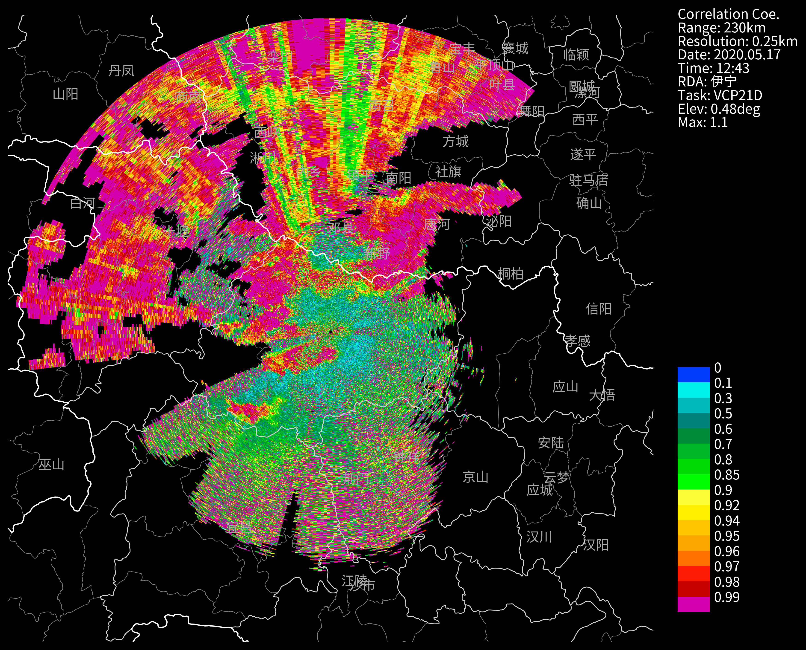
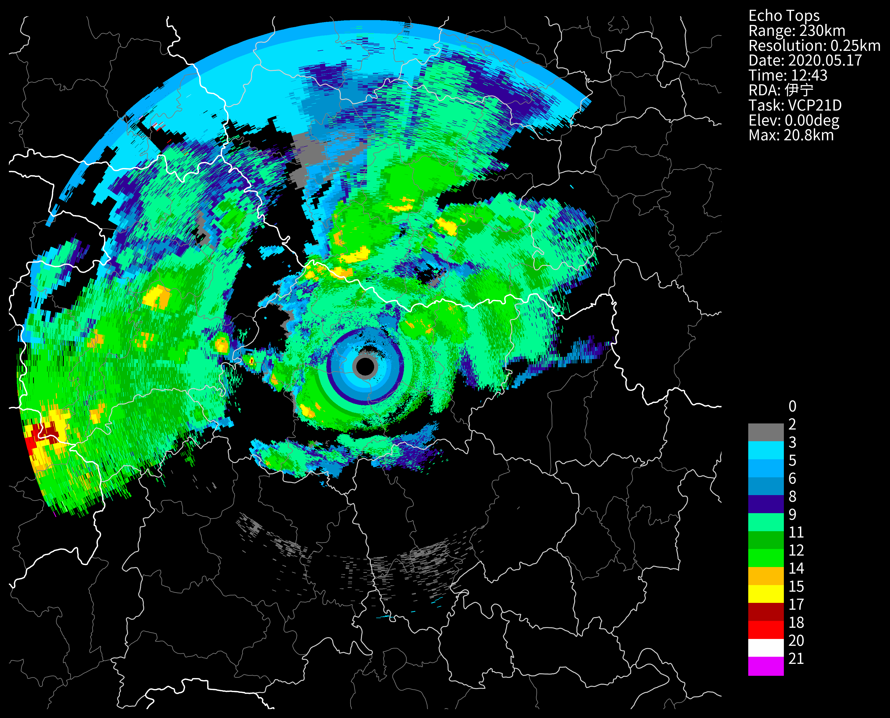
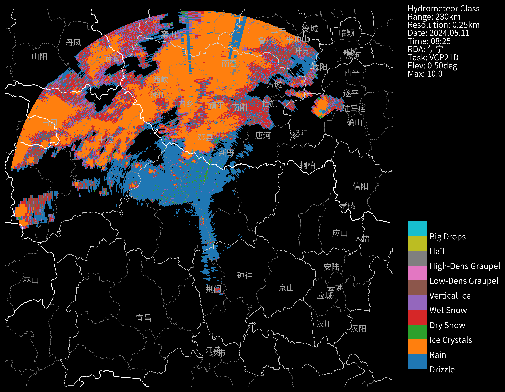

# 标准格式基数据
```python
nFiles = basePath + "/cinrad/bz2/Z_RADR_I_Z9532_20200517124300_O_DOR_SAD_CAP_FMT.bin.bz2"
f= cinrad.io.read_auto(nFiles)
data = f.get_data(0,230,"REF") # 读取第一层的反射率

data
```
```md
<xarray.Dataset> Size: 11MB
Dimensions:    (azimuth: 366, distance: 920)
Coordinates:
  * azimuth    (azimuth) float32 1kB 1.827 1.845 1.862 ... 1.796 1.814 1.83
  * distance   (distance) float64 7kB 0.25 0.5 0.75 1.0 ... 229.5 229.8 230.0
Data variables:
    REF        (azimuth, distance) float64 3MB nan nan nan nan ... nan nan nan
    longitude  (azimuth, distance) float64 3MB 112.0 112.0 112.0 ... 114.3 114.3
    latitude   (azimuth, distance) float64 3MB 32.0 32.0 32.0 ... 31.47 31.47
    height     (azimuth, distance) float64 3MB 1.12e+06 1.12e+06 ... 1.12e+06
Attributes:
    elevation:        0.48339844
    range:            230
    scan_time:        2020-05-17 12:43:00
    site_code:        Z9999
    site_name:        伊宁
    site_longitude:   112.0
    site_latitude:    32.0
    tangential_reso:  0.25
    nyquist_vel:      8.37801
    task:             VCP21D
```
```python
f.available_product(0) #第0个仰角有哪些产品可以读取
```
```md
['TREF', 'REF', 'SQI', 'ZDR', 'RHO', 'PHI', 'KDP', 'SNRH']
```
```python
f.available_tilt('REF') #REF产品有哪些仰角可以读取
```
```md
[np.int32(0),
 np.int32(2),
 np.int32(4),
 np.int32(5),
 np.int32(6),
 np.int32(7),
 np.int32(8),
 np.int32(9),
 np.int32(10)]
```
```python
f.available_tilt('VEL') #VEL产品有哪些仰角可以读取
```
```md
[np.int32(1),
 np.int32(3),
 np.int32(4),
 np.int32(5),
 np.int32(6),
 np.int32(7),
 np.int32(8),
 np.int32(9),
 np.int32(10)]
```
```python
f.el # 雷达的仰角
```
```md
[np.float32(0.48339844),
 np.float32(0.48339844),
 np.float32(1.4941406),
 np.float32(1.4941406),
 np.float32(2.4169922),
 np.float32(3.2958984),
 np.float32(4.3066406),
 np.float32(6.020508),
 np.float32(9.887695),
 np.float32(14.589844),
 np.float32(19.511719)]
```
```python
f.scan_config
```
```md
[ScanConfig(process_mode=1, wave_form=0, PRF1=322.0, PRF2=322.0, dealias_mode=1, azimuth=0.0, elev=0.48339844, start_angle=0.0, end_angle=0.0, angular_reso=1.0, scan_spd=11.34, log_reso=250, dop_reso=250, max_range1=460000, max_range2=460000, start_range=0, sample1=28, sample2=28, phase_mode=0, atmos_loss=0.011, nyquist_spd=8.37801, moments_mask=69286, moments_size_mask=1152, misc_filter_mask=255, SQI_thres=0.4, SIG_thres=5.0, CSR_thres=60.0, LOG_thres=3.0, CPA_thres=0.0, PMI_thres=0.45, DPLOG_thres=5.0, res_thres=void(b'\x00\x00\x00\x00'), dBT_mask=1, dBZ_mask=1, vel_mask=1, sw_mask=1, DP_mask=32, res_mask=void(b'\x00\x00\x00\x00\x00\x00\x00\x00\x00\x00\x00\x00'), scan_sync=0, direction=1, ground_clutter_classifier_type=3, ground_clutter_filter_type=1, ground_clutter_filter_notch_width=3, ground_clutter_filter_window=1, res4=void(b'\x01\x03\x03\x00\x00\x00\x00\x00\x00\x00\x00\x00\x00\x00\x00\x00\x00\x00\x00\x00\x00\x00\x00\x00\x00\x00\x00\x00\x00\x00\x00\x00\x00\x00\x00\x00\x00\x00\x00\x00\x00\x00\x00\x00\x00\x00\x00\x00\x00\x00\x00\x00\x00\x00\x00\x00\x00\x00\x00\x00\x00\x00\x00\x00\x00\x00\x00\x00\x00\x00\x00\x00')),
 ScanConfig(process_mode=1, wave_form=1, PRF1=1014.0, PRF2=1014.0, dealias_mode=1, azimuth=0.0, elev=0.48339844, start_angle=0.0, end_angle=0.0, angular_reso=1.0, scan_spd=15.84, log_reso=250, dop_reso=250, max_range1=300000, max_range2=300000, start_range=0, sample1=64, sample2=64, phase_mode=2, atmos_loss=0.011, nyquist_spd=26.382925, moments_mask=67108888, moments_size_mask=0, misc_filter_mask=63, SQI_thres=0.4, SIG_thres=5.0, CSR_thres=60.0, LOG_thres=3.0, CPA_thres=0.0, PMI_thres=0.45, DPLOG_thres=5.0, res_thres=void(b'\x00\x00\x00\x00'), dBT_mask=1, dBZ_mask=1, vel_mask=1, sw_mask=1, DP_mask=32, res_mask=void(b'\x00\x00\x00\x00\x00\x00\x00\x00\x00\x00\x00\x00'), scan_sync=0, direction=0, ground_clutter_classifier_type=3, ground_clutter_filter_type=1, ground_clutter_filter_notch_width=3, ground_clutter_filter_window=1, res4=void(b'\x01\x03\x03\x00\x00\x00\x00\x00\x00\x00\x00\x00\x00\x00\x00\x00\x00\x00\x00\x00\x00\x00\x00\x00\x00\x00\x00\x00\x00\x00\x00\x00\x00\x00\x00\x00\x00\x00\x00\x00\x00\x00\x00\x00\x00\x00\x00\x00\x00\x00\x00\x00\x00\x00\x00\x00\x00\x00\x00\x00\x00\x00\x00\x00\x00\x00\x00\x00\x00\x00\x00\x00')),
 ScanConfig(process_mode=1, wave_form=0, PRF1=322.0, PRF2=322.0, dealias_mode=1, azimuth=0.0, elev=1.4941406, start_angle=0.0, end_angle=0.0, angular_reso=1.0, scan_spd=11.34, log_reso=250, dop_reso=250, max_range1=460000, max_range2=460000, start_range=0, sample1=28, sample2=28, phase_mode=0, atmos_loss=0.011, nyquist_spd=8.37801, moments_mask=69254, moments_size_mask=1152, misc_filter_mask=127, SQI_thres=0.4, SIG_thres=5.0, CSR_thres=60.0, LOG_thres=3.0, CPA_thres=0.0, PMI_thres=0.45, DPLOG_thres=5.0, res_thres=void(b'\x00\x00\x00\x00'), dBT_mask=1, dBZ_mask=1, vel_mask=1, sw_mask=1, DP_mask=32, res_mask=void(b'\x00\x00\x00\x00\x00\x00\x00\x00\x00\x00\x00\x00'), scan_sync=0, direction=0, ground_clutter_classifier_type=3, ground_clutter_filter_type=1, ground_clutter_filter_notch_width=3, ground_clutter_filter_window=1, res4=void(b'\x01\x03\x03\x00\x00\x00\x00\x00\x00\x00\x00\x00\x00\x00\x00\x00\x00\x00\x00\x00\x00\x00\x00\x00\x00\x00\x00\x00\x00\x00\x00\x00\x00\x00\x00\x00\x00\x00\x00\x00\x00\x00\x00\x00\x00\x00\x00\x00\x00\x00\x00\x00\x00\x00\x00\x00\x00\x00\x00\x00\x00\x00\x00\x00\x00\x00\x00\x00\x00\x00\x00\x00')),
 ScanConfig(process_mode=1, wave_form=1, PRF1=1014.0, PRF2=1014.0, dealias_mode=1, azimuth=0.0, elev=1.4941406, start_angle=0.0, end_angle=0.0, angular_reso=1.0, scan_spd=15.84, log_reso=250, dop_reso=250, max_range1=300000, max_range2=300000, start_range=0, sample1=64, sample2=64, phase_mode=2, atmos_loss=0.011, nyquist_spd=26.382925, moments_mask=67108888, moments_size_mask=0, misc_filter_mask=63, SQI_thres=0.4, SIG_thres=5.0, CSR_thres=60.0, LOG_thres=3.0, CPA_thres=0.0, PMI_thres=0.45, DPLOG_thres=5.0, res_thres=void(b'\x00\x00\x00\x00'), dBT_mask=1, dBZ_mask=1, vel_mask=1, sw_mask=1, DP_mask=32, res_mask=void(b'\x00\x00\x00\x00\x00\x00\x00\x00\x00\x00\x00\x00'), scan_sync=0, direction=0, ground_clutter_classifier_type=3, ground_clutter_filter_type=1, ground_clutter_filter_notch_width=3, ground_clutter_filter_window=1, res4=void(b'\x01\x03\x03\x00\x00\x00\x00\x00\x00\x00\x00\x00\x00\x00\x00\x00\x00\x00\x00\x00\x00\x00\x00\x00\x00\x00\x00\x00\x00\x00\x00\x00\x00\x00\x00\x00\x00\x00\x00\x00\x00\x00\x00\x00\x00\x00\x00\x00\x00\x00\x00\x00\x00\x00\x00\x00\x00\x00\x00\x00\x00\x00\x00\x00\x00\x00\x00\x00\x00\x00\x00\x00')),
 ScanConfig(process_mode=1, wave_form=4, PRF1=1014.0, PRF2=446.0, dealias_mode=1, azimuth=0.0, elev=2.4169922, start_angle=0.0, end_angle=0.0, angular_reso=1.0, scan_spd=11.18, log_reso=250, dop_reso=250, max_range1=146000, max_range2=330000, start_range=0, sample1=72, sample2=8, phase_mode=0, atmos_loss=0.011, nyquist_spd=26.382925, moments_mask=69278, moments_size_mask=1152, misc_filter_mask=63, SQI_thres=0.4, SIG_thres=5.0, CSR_thres=60.0, LOG_thres=3.0, CPA_thres=0.0, PMI_thres=0.45, DPLOG_thres=5.0, res_thres=void(b'\x00\x00\x00\x00'), dBT_mask=1, dBZ_mask=1, vel_mask=1, sw_mask=1, DP_mask=32, res_mask=void(b'\x00\x00\x00\x00\x00\x00\x00\x00\x00\x00\x00\x00'), scan_sync=0, direction=0, ground_clutter_classifier_type=3, ground_clutter_filter_type=1, ground_clutter_filter_notch_width=3, ground_clutter_filter_window=1, res4=void(b'\x03\x03\x03\x00\x00\x00\x00\x00\x00\x00\x00\x00\x00\x00\x00\x00\x00\x00\x00\x00\x00\x00\x00\x00\x00\x00\x00\x00\x00\x00\x00\x00\x00\x00\x00\x00\x00\x00\x00\x00\x00\x00\x00\x00\x00\x00\x00\x00\x00\x00\x00\x00\x00\x00\x00\x00\x00\x00\x00\x00\x00\x00\x00\x00\x00\x00\x00\x00\x00\x00\x00\x00')),
 ScanConfig(process_mode=1, wave_form=4, PRF1=1014.0, PRF2=446.0, dealias_mode=1, azimuth=0.0, elev=3.2958984, start_angle=0.0, end_angle=0.0, angular_reso=1.0, scan_spd=11.18, log_reso=250, dop_reso=250, max_range1=146000, max_range2=330000, start_range=0, sample1=72, sample2=8, phase_mode=0, atmos_loss=0.011, nyquist_spd=26.382925, moments_mask=69278, moments_size_mask=1152, misc_filter_mask=63, SQI_thres=0.4, SIG_thres=5.0, CSR_thres=60.0, LOG_thres=3.0, CPA_thres=0.0, PMI_thres=0.45, DPLOG_thres=5.0, res_thres=void(b'\x00\x00\x00\x00'), dBT_mask=1, dBZ_mask=1, vel_mask=1, sw_mask=1, DP_mask=32, res_mask=void(b'\x00\x00\x00\x00\x00\x00\x00\x00\x00\x00\x00\x00'), scan_sync=0, direction=0, ground_clutter_classifier_type=3, ground_clutter_filter_type=1, ground_clutter_filter_notch_width=3, ground_clutter_filter_window=1, res4=void(b'\x03\x03\x03\x00\x00\x00\x00\x00\x00\x00\x00\x00\x00\x00\x00\x00\x00\x00\x00\x00\x00\x00\x00\x00\x00\x00\x00\x00\x00\x00\x00\x00\x00\x00\x00\x00\x00\x00\x00\x00\x00\x00\x00\x00\x00\x00\x00\x00\x00\x00\x00\x00\x00\x00\x00\x00\x00\x00\x00\x00\x00\x00\x00\x00\x00\x00\x00\x00\x00\x00\x00\x00')),
 ScanConfig(process_mode=1, wave_form=4, PRF1=1014.0, PRF2=446.0, dealias_mode=1, azimuth=0.0, elev=4.3066406, start_angle=0.0, end_angle=0.0, angular_reso=1.0, scan_spd=11.18, log_reso=250, dop_reso=250, max_range1=146000, max_range2=330000, start_range=0, sample1=72, sample2=8, phase_mode=0, atmos_loss=0.011, nyquist_spd=26.382925, moments_mask=69278, moments_size_mask=1152, misc_filter_mask=63, SQI_thres=0.4, SIG_thres=5.0, CSR_thres=60.0, LOG_thres=3.0, CPA_thres=0.0, PMI_thres=0.45, DPLOG_thres=5.0, res_thres=void(b'\x00\x00\x00\x00'), dBT_mask=1, dBZ_mask=1, vel_mask=1, sw_mask=1, DP_mask=32, res_mask=void(b'\x00\x00\x00\x00\x00\x00\x00\x00\x00\x00\x00\x00'), scan_sync=0, direction=0, ground_clutter_classifier_type=3, ground_clutter_filter_type=1, ground_clutter_filter_notch_width=3, ground_clutter_filter_window=1, res4=void(b'\x03\x03\x03\x00\x00\x00\x00\x00\x00\x00\x00\x00\x00\x00\x00\x00\x00\x00\x00\x00\x00\x00\x00\x00\x00\x00\x00\x00\x00\x00\x00\x00\x00\x00\x00\x00\x00\x00\x00\x00\x00\x00\x00\x00\x00\x00\x00\x00\x00\x00\x00\x00\x00\x00\x00\x00\x00\x00\x00\x00\x00\x00\x00\x00\x00\x00\x00\x00\x00\x00\x00\x00')),
 ScanConfig(process_mode=1, wave_form=4, PRF1=1014.0, PRF2=644.0, dealias_mode=1, azimuth=0.0, elev=6.020508, start_angle=0.0, end_angle=0.0, angular_reso=1.0, scan_spd=11.18, log_reso=250, dop_reso=250, max_range1=146000, max_range2=228000, start_range=0, sample1=78, sample2=8, phase_mode=0, atmos_loss=0.011, nyquist_spd=26.382925, moments_mask=69278, moments_size_mask=1152, misc_filter_mask=63, SQI_thres=0.4, SIG_thres=5.0, CSR_thres=60.0, LOG_thres=3.0, CPA_thres=0.0, PMI_thres=0.45, DPLOG_thres=5.0, res_thres=void(b'\x00\x00\x00\x00'), dBT_mask=1, dBZ_mask=1, vel_mask=1, sw_mask=1, DP_mask=32, res_mask=void(b'\x00\x00\x00\x00\x00\x00\x00\x00\x00\x00\x00\x00'), scan_sync=0, direction=0, ground_clutter_classifier_type=3, ground_clutter_filter_type=1, ground_clutter_filter_notch_width=3, ground_clutter_filter_window=1, res4=void(b'\x01\x03\x03\x00\x00\x00\x00\x00\x00\x00\x00\x00\x00\x00\x00\x00\x00\x00\x00\x00\x00\x00\x00\x00\x00\x00\x00\x00\x00\x00\x00\x00\x00\x00\x00\x00\x00\x00\x00\x00\x00\x00\x00\x00\x00\x00\x00\x00\x00\x00\x00\x00\x00\x00\x00\x00\x00\x00\x00\x00\x00\x00\x00\x00\x00\x00\x00\x00\x00\x00\x00\x00')),
 ScanConfig(process_mode=1, wave_form=2, PRF1=1181.0, PRF2=1181.0, dealias_mode=1, azimuth=0.0, elev=9.887695, start_angle=0.0, end_angle=0.0, angular_reso=1.0, scan_spd=18.0, log_reso=250, dop_reso=250, max_range1=124000, max_range2=124000, start_range=0, sample1=65, sample2=65, phase_mode=0, atmos_loss=0.011, nyquist_spd=30.728043, moments_mask=69278, moments_size_mask=1152, misc_filter_mask=63, SQI_thres=0.4, SIG_thres=5.0, CSR_thres=60.0, LOG_thres=3.0, CPA_thres=0.0, PMI_thres=0.45, DPLOG_thres=5.0, res_thres=void(b'\x00\x00\x00\x00'), dBT_mask=1, dBZ_mask=1, vel_mask=1, sw_mask=1, DP_mask=32, res_mask=void(b'\x00\x00\x00\x00\x00\x00\x00\x00\x00\x00\x00\x00'), scan_sync=0, direction=0, ground_clutter_classifier_type=3, ground_clutter_filter_type=1, ground_clutter_filter_notch_width=3, ground_clutter_filter_window=1, res4=void(b'\x03\x03\x03\x00\x00\x00\x00\x00\x00\x00\x00\x00\x00\x00\x00\x00\x00\x00\x00\x00\x00\x00\x00\x00\x00\x00\x00\x00\x00\x00\x00\x00\x00\x00\x00\x00\x00\x00\x00\x00\x00\x00\x00\x00\x00\x00\x00\x00\x00\x00\x00\x00\x00\x00\x00\x00\x00\x00\x00\x00\x00\x00\x00\x00\x00\x00\x00\x00\x00\x00\x00\x00')),
 ScanConfig(process_mode=1, wave_form=2, PRF1=1181.0, PRF2=1181.0, dealias_mode=1, azimuth=0.0, elev=14.589844, start_angle=0.0, end_angle=0.0, angular_reso=1.0, scan_spd=18.0, log_reso=250, dop_reso=250, max_range1=124000, max_range2=124000, start_range=0, sample1=65, sample2=65, phase_mode=0, atmos_loss=0.011, nyquist_spd=30.728043, moments_mask=69278, moments_size_mask=1152, misc_filter_mask=63, SQI_thres=0.4, SIG_thres=5.0, CSR_thres=60.0, LOG_thres=3.0, CPA_thres=0.0, PMI_thres=0.45, DPLOG_thres=5.0, res_thres=void(b'\x00\x00\x00\x00'), dBT_mask=1, dBZ_mask=1, vel_mask=1, sw_mask=1, DP_mask=32, res_mask=void(b'\x00\x00\x00\x00\x00\x00\x00\x00\x00\x00\x00\x00'), scan_sync=0, direction=0, ground_clutter_classifier_type=3, ground_clutter_filter_type=1, ground_clutter_filter_notch_width=3, ground_clutter_filter_window=1, res4=void(b'\x03\x03\x03\x00\x00\x00\x00\x00\x00\x00\x00\x00\x00\x00\x00\x00\x00\x00\x00\x00\x00\x00\x00\x00\x00\x00\x00\x00\x00\x00\x00\x00\x00\x00\x00\x00\x00\x00\x00\x00\x00\x00\x00\x00\x00\x00\x00\x00\x00\x00\x00\x00\x00\x00\x00\x00\x00\x00\x00\x00\x00\x00\x00\x00\x00\x00\x00\x00\x00\x00\x00\x00')),
 ScanConfig(process_mode=1, wave_form=2, PRF1=1181.0, PRF2=1181.0, dealias_mode=1, azimuth=0.0, elev=19.511719, start_angle=0.0, end_angle=0.0, angular_reso=1.0, scan_spd=18.0, log_reso=250, dop_reso=250, max_range1=124000, max_range2=124000, start_range=0, sample1=65, sample2=65, phase_mode=0, atmos_loss=0.011, nyquist_spd=30.728043, moments_mask=69278, moments_size_mask=1152, misc_filter_mask=63, SQI_thres=0.4, SIG_thres=5.0, CSR_thres=60.0, LOG_thres=3.0, CPA_thres=0.0, PMI_thres=0.45, DPLOG_thres=5.0, res_thres=void(b'\x00\x00\x00\x00'), dBT_mask=1, dBZ_mask=1, vel_mask=1, sw_mask=1, DP_mask=32, res_mask=void(b'\x00\x00\x00\x00\x00\x00\x00\x00\x00\x00\x00\x00'), scan_sync=0, direction=0, ground_clutter_classifier_type=3, ground_clutter_filter_type=1, ground_clutter_filter_notch_width=3, ground_clutter_filter_window=1, res4=void(b'\x03\x03\x03\x00\x00\x00\x00\x00\x00\x00\x00\x00\x00\x00\x00\x00\x00\x00\x00\x00\x00\x00\x00\x00\x00\x00\x00\x00\x00\x00\x00\x00\x00\x00\x00\x00\x00\x00\x00\x00\x00\x00\x00\x00\x00\x00\x00\x00\x00\x00\x00\x00\x00\x00\x00\x00\x00\x00\x00\x00\x00\x00\x00\x00\x00\x00\x00\x00\x00\x00\x00\x00'))]
```
```python
f.scantime
```
```md
datetime.datetime(2020, 5, 17, 12, 43, tzinfo=datetime.timezone.utc)
```
```python
vel0 = f.get_data(1,230,"VEL") # 速度只有1,3,4....10

vel0
```
```md
<xarray.Dataset> Size: 13MB
Dimensions:    (azimuth: 360, distance: 920)
Coordinates:
  * azimuth    (azimuth) float32 1kB 2.101 2.12 2.137 ... 2.062 2.079 2.097
  * distance   (distance) float64 7kB 0.25 0.5 0.75 1.0 ... 229.5 229.8 230.0
Data variables:
    VEL        (azimuth, distance) float64 3MB nan nan nan nan ... nan nan nan
    longitude  (azimuth, distance) float64 3MB 112.0 112.0 112.0 ... 114.1 114.1
    latitude   (azimuth, distance) float64 3MB 32.0 32.0 32.0 ... 30.96 30.96
    height     (azimuth, distance) float64 3MB 1.12e+06 1.12e+06 ... 1.12e+06
    RF         (azimuth, distance) float64 3MB nan nan nan nan ... nan nan nan
Attributes:
    elevation:        0.48339844
    range:            230
    scan_time:        2020-05-17 12:43:00
    site_code:        Z9999
    site_name:        伊宁
    site_longitude:   112.0
    site_latitude:    32.0
    tangential_reso:  0.25
    nyquist_vel:      26.382925
    task:             VCP21D
```
```python
f.scantime = f.scantime + datetime.timedelta(hours=8) # 修改为北京时间
velbjt = f.get_data(1,230,"VEL") # 速度只有1,3,4....10
velbjt
```
```md
<xarray.Dataset> Size: 13MB
Dimensions:    (azimuth: 360, distance: 920)
Coordinates:
  * azimuth    (azimuth) float32 1kB 2.101 2.12 2.137 ... 2.062 2.079 2.097
  * distance   (distance) float64 7kB 0.25 0.5 0.75 1.0 ... 229.5 229.8 230.0
Data variables:
    VEL        (azimuth, distance) float64 3MB nan nan nan nan ... nan nan nan
    longitude  (azimuth, distance) float64 3MB 112.0 112.0 112.0 ... 114.1 114.1
    latitude   (azimuth, distance) float64 3MB 32.0 32.0 32.0 ... 30.96 30.96
    height     (azimuth, distance) float64 3MB 1.12e+06 1.12e+06 ... 1.12e+06
    RF         (azimuth, distance) float64 3MB nan nan nan nan ... nan nan nan
Attributes:
    elevation:        0.48339844
    range:            230
    scan_time:        2020-05-17 20:43:00
    site_code:        Z9999
    site_name:        伊宁
    site_longitude:   112.0
    site_latitude:    32.0
    tangential_reso:  0.25
    nyquist_vel:      26.382925
    task:             VCP21D
```
相关系数CC
```python
cc = f.get_data(0,230,"RHO") # KDP/ZDR/RHO
fig = cinrad.visualize.PPI(cc,style="black",add_city_names=True)
# 将图片保存
# fig("d:/")
# 或者 fig("d:/abc.png")
# 或者 imgName = fig("d:/")
```

## 计算CR
```python
r_list = list(f.iter_tilt(230, 'REF'))
cr = cinrad.calc.quick_cr(r_list)

cr
```
```md
<xarray.Dataset> Size: 8MB
Dimensions:    (latitude: 1000, longitude: 1000)
Coordinates:
  * latitude   (latitude) float64 8kB 29.93 29.93 29.94 ... 34.06 34.07 34.07
  * longitude  (longitude) float64 8kB 109.6 109.6 109.6 ... 114.4 114.4 114.4
Data variables:
    CR         (latitude, longitude) float64 8MB nan nan nan nan ... nan nan nan
Attributes:
    elevation:        0
    range:            230
    scan_time:        2020-05-17 12:43:00
    site_code:        Z9999
    site_name:        伊宁
    site_longitude:   112.0
    site_latitude:    32.0
    tangential_reso:  0.25
    nyquist_vel:      30.728043
    task:             VCP21D
```
```python
cr.sel(latitude=30.0,longitude=120.0,method="nearest")
```
```md
<xarray.Dataset> Size: 24B
Dimensions:    ()
Coordinates:
    latitude   float64 8B 30.0
    longitude  float64 8B 114.4
Data variables:
    CR         float64 8B nan
Attributes:
    elevation:        0
    range:            230
    scan_time:        2020-05-17 12:43:00
    site_code:        Z9999
    site_name:        伊宁
    site_longitude:   112.0
    site_latitude:    32.0
    tangential_reso:  0.25
    nyquist_vel:      30.728043
    task:             VCP21D
```
## 计算ET
```python
et = cinrad.calc.quick_et(r_list)

et
```
```md
<xarray.Dataset> Size: 8MB
Dimensions:    (azimuth: 361, distance: 920)
Coordinates:
  * azimuth    (azimuth) float64 3kB 0.0 0.01745 0.03491 ... 6.248 6.266 6.283
  * distance   (distance) float64 7kB 0.25 0.5 0.75 1.0 ... 229.5 229.8 230.0
Data variables:
    ET         (azimuth, distance) float64 3MB nan nan nan ... 5.034 5.043 5.052
    longitude  (azimuth, distance) float64 3MB 112.0 112.0 112.0 ... 112.0 112.0
    latitude   (azimuth, distance) float64 3MB 32.0 32.0 32.01 ... 34.07 34.07
Attributes:
    elevation:        0
    range:            230
    scan_time:        2020-05-17 12:43:00
    site_code:        Z9999
    site_name:        伊宁
    site_longitude:   112.0
    site_latitude:    32.0
    tangential_reso:  0.25
    nyquist_vel:      8.37801
    task:             VCP21D
```
```python
# 计算VIL、VILD
# vil = cinrad.calc.quick_vil(r_list)
# vild = cinrad.calc.quick_vild(r_list)
```
```python
# 画个图试试
fig = cinrad.visualize.PPI(et,style="black")
# 将图片保存
# fig("d:/")
# 或者 fig("d:/abc.png")
# 或者 imgName = fig("d:/")
```

## 计算HCL
CINRAD使用的论文中的算法（详见github底部）
```python
nFiles = basePath + "/cinrad/bz2/Z_RADR_I_Z9735_20240511082558_O_DOR_SAD_CAP_FMT.bin.bz2"
f = cinrad.io.read_auto(nFiles)
ref = f.get_data(0, 230, "REF")  # 这里全部使用的是第一个仰角的
zdr = f.get_data(0, 230, "ZDR")
rho = f.get_data(0, 230, "RHO")
kdp = f.get_data(0, 230, "KDP")
cHCL = cinrad.calc.hydro_class(ref, zdr, rho, kdp, band="S")  # band手动输入S/C/X
cHCL
fig = cinrad.visualize.PPI(cHCL, add_city_names=True, dpi=300, style="black")
```

## 导出为pyart
```python
from cinrad.io.export import standard_data_to_pyart
nFiles = basePath + "/cinrad/bz2/Z_RADR_I_Z9731_20240510070522_O_DOR_SAD_CAP_FMT.bin.bz2"
f = cinrad.io.read_auto(nFiles)
print(f.available_product(0))
sradar = standard_data_to_pyart(f)
sradar
```
```md
## You are using the Python ARM Radar Toolkit (Py-ART), an open source
## library for working with weather radar data. Py-ART is partly
## supported by the U.S. Department of Energy as part of the Atmospheric
## Radiation Measurement (ARM) Climate Research Facility, an Office of
## Science user facility.
##
## If you use this software to prepare a publication, please cite:
##
##     JJ Helmus and SM Collis, JORS 2016, doi: 10.5334/jors.119

['TREF', 'REF', 'ZDR', 'RHO', 'PHI', 'KDP', 'SNRH']
```
```md
<pyart.core.radar.Radar at 0x194a16bcb50>
```
