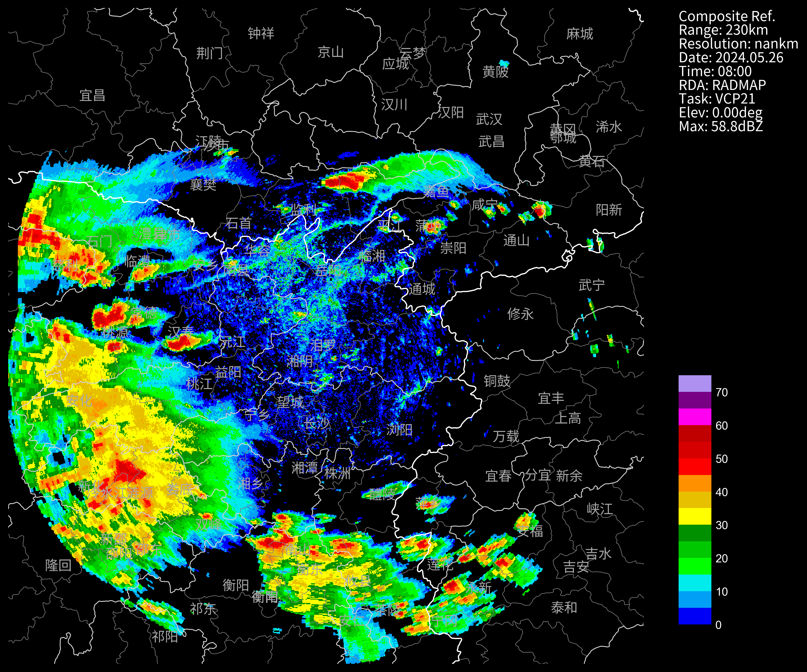

# 雷达拼图

## 基本反射率拼图

`cinrad.calc.GridMapper`,`v1.9.2支持`，理论上 ZDR、KDP 这些也可以拼图，前提是`数据是取各层的最大值`。

```python
# 读取BR
mergePath = "d:/temp/cinrad/cr/"
file1 = mergePath + "Z_RADR_I_Z9730_20240526075538_O_DOR_SB_CAP_FMT.bin.bz2"
file2 = mergePath + "Z_RADR_I_Z9731_20240526075702_O_DOR_SAD_CAP_FMT.bin.bz2"
f1 = cinrad.io.read_auto(file1)
br1 = f1.get_data(0, 230, "REF")
f2 = cinrad.io.read_auto(file2)
br2 = f2.get_data(0, 230, "REF")

# 极坐标转换为经纬度坐标
br1_cr = cinrad.calc.polar_to_xy(br1)
br2_cr = cinrad.calc.polar_to_xy(br2)

# 拼图
gm_br = cinrad.calc.GridMapper([br1_cr, br2_cr])
grid_br = gm_br(step=0.005) # 0.005是拼图的网格经纬度步长
# 画图
fig = cinrad.visualize.PPI(grid_br, style="black", add_city_names=True)
```

```md
<xarray.Dataset> Size: 8MB
Dimensions: (latitude: 997, longitude: 966)
Coordinates:

- latitude (latitude) float64 8kB 26.39 26.39 26.4 ... 31.36 31.36 31.37
- longitude (longitude) float64 8kB 110.7 110.7 110.7 ... 115.5 115.5 115.5
  Data variables:
  REF (latitude, longitude) float64 8MB nan nan nan nan ... nan nan nan
  Attributes:
  elevation: 0
  range: 230
  scan_time: 2024-05-26 08:00:20
  site_code: RADMAP
  site_name: RADMAP
  tangential_reso: nan
  task: VCP21
```


## 组合反射率拼图

`v1.9.2支持`，理论上 ZDR、KDP 这些也可以拼图，前提是`数据是取各层的最大值`。

```python
# 读取所有层的反射率
mergePath = "d:/temp/cinrad/cr/"
file1 = mergePath + "Z_RADR_I_Z9730_20240526075538_O_DOR_SB_CAP_FMT.bin.bz2"
file2 = mergePath + "Z_RADR_I_Z9731_20240526075702_O_DOR_SAD_CAP_FMT.bin.bz2"
f1 = cinrad.io.read_auto(file1)  # 读取文件
list1 = list(f1.iter_tilt(230, "REF"))
f2 = cinrad.io.read_auto(file2)
list2 = list(f2.iter_tilt(230, "REF"))
# 计算CR
cr1 = cinrad.calc.quick_cr(list1)
cr2 = cinrad.calc.quick_cr(list2)
# 拼图
gm_cr = cinrad.calc.GridMapper([cr1, cr2])
grid_cr = gm_cr(step=0.005)
# 画图
fig = cinrad.visualize.PPI(grid_cr, style="black", add_city_names=True)
```

```md
<xarray.Dataset> Size: 8MB
Dimensions: (latitude: 997, longitude: 966)
Coordinates:

- latitude (latitude) float64 8kB 26.39 26.39 26.4 ... 31.36 31.36 31.37
- longitude (longitude) float64 8kB 110.7 110.7 110.7 ... 115.5 115.5 115.5
  Data variables:
  CR (latitude, longitude) float64 8MB nan nan nan nan ... nan nan nan
  Attributes:
  elevation: 0
  range: 230
  scan_time: 2024-05-26 08:00:20
  site_code: RADMAP
  site_name: RADMAP
  tangential_reso: nan
  task: VCP21
```


