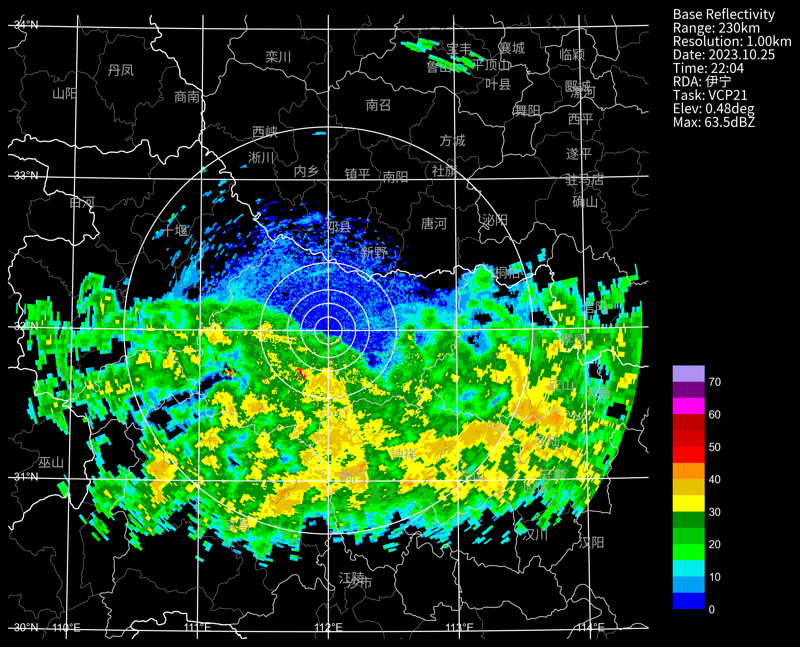
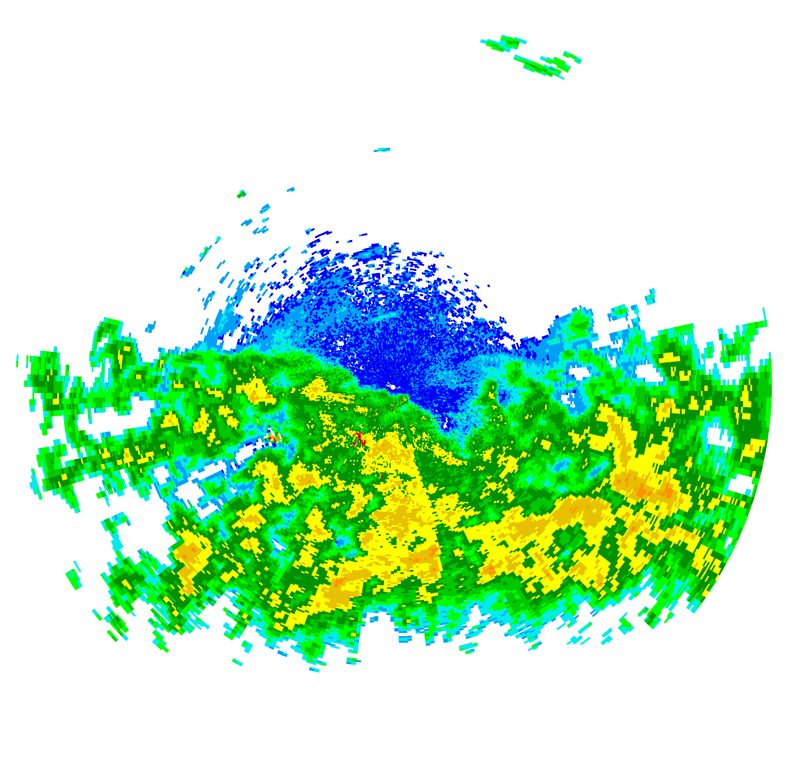
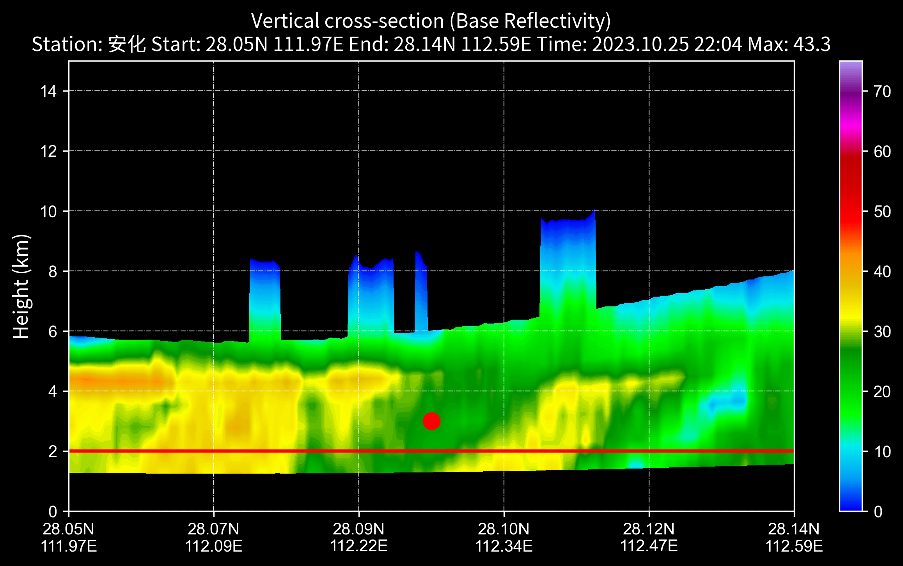
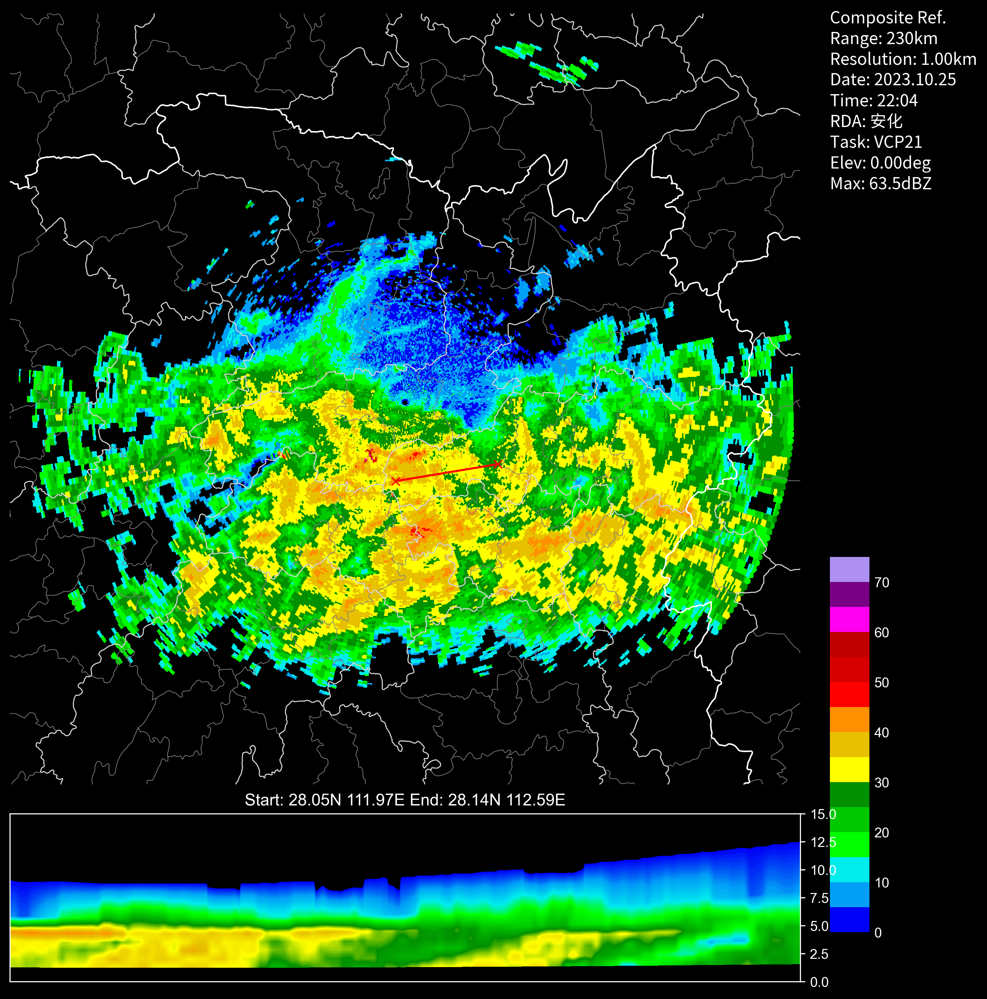
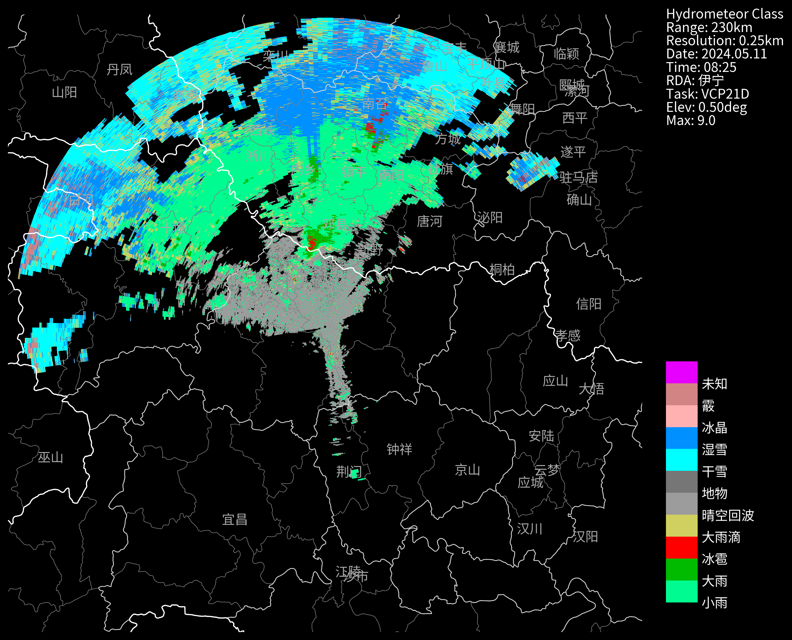
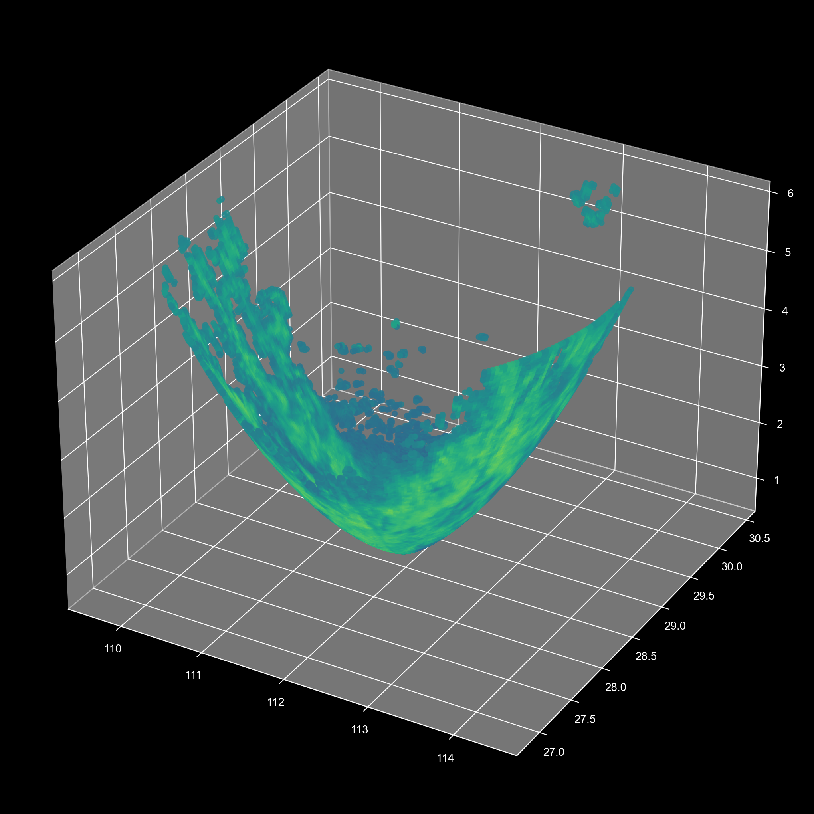
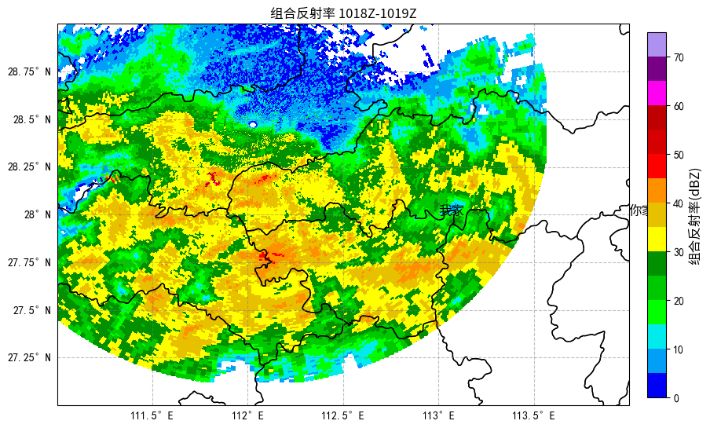

## 画图基本操作
PyCINRAD具备单独的画图接口，即cinrad.visualize.PPI，该函数有以下参数：
|参数|数据类型|默认值|功能|
|:---:|:---:|:---:|:---:|
|data|xarray.Dataset|——|雷达数据，为xarray.Dataset类型|
|cmap|Colormap|None|色阶（matplotlib.colors）|
|norm|Normalize|None|色阶范围（matplotlib.colors）|
|nlabel|int|10|色阶条标注个数|
|label|List[str]|None|色阶条标注文字|
|dpi|int|350|图片的分辨率|
|extent|list[float]|None|绘图的经纬度范围 e.g. extent=[90, 91, 29, 30]|
|section||None|在ppi图中绘制的剖面的数据，参考剖面图接口|
|style|str|black|背景颜色:黑色black或白色white或透明transparent|
|add_city_names|bool|False|地图上是否标注城市名|
|plot_labels|bool|True|右侧是否标注文字|
|add_shps|bool|True|地图上是否绘制国省市县边界线|
|text_param|dict|None|所有文字、线条的字体，e.g. {"color": "blue", "fontsize": 12}|

```python
# 读取数据，这里以BR为例
nFiles = basePath + "/cinrad/bz2/Z_RADR_I_Z9737_20231025220414_O_DOR_SA_CAP_FMT.bin.bz2"
f = cinrad.io.read_auto(nFiles)

# 想把时间改成北京时？
# f.scantime = f.scantime + datetime.timedelta(hours=8)
data = f.get_data(0, 230, "REF")

# 开始画图
fig = PPI(
    data, 
    dpi=300, 
    style="black", 
    add_city_names=True,
    add_shps=True,
    plot_labels=True,
    extent=[90, 91, 29, 30]
    text_param={"color": "white", "fontsize": 12}
)

# 如果是在ipynb下运行时，此时图片已经可以看到；
# 如果是在正式的脚本下，则需要保存为图片文件。
```

### 子函数
还想在图上画点其他的？CINRAD提供了以下子函数：
- fig.plot_range_rings(ranges,color,linewidth)  # 画圈，参数：距离列表，颜色，线宽。
- fig.gridlines(draw_labels=True,linewidth,color)  # 画经纬度网格线，参数：是否标注经纬度数字，线宽，颜色。
- fig.plot_ring_rays(angles,range)，绘制射线，参数：角度列表，距离，颜色，线宽。
- fig.add_custom_shp(shp_path,encoding: str = "gbk",color,linewidth)，自定义边界，参数：shp文件路径，编码，颜色，线宽。


```python
# 1.画圈
fig.plot_range_rings([10, 20, 30, 50, 150], color="white", linewidth=1)  # 用这个来画圈

# 2.画经纬度网格线
fig.gridlines(draw_labels=True, linewidth=1, color="white")  # 用这个来画经纬度网格线


# 3.画散点
import cartopy.crs as ccrs
fig.geoax.scatter(
    x=112.34, y=32.22, s=500, c="r", marker=".", transform=ccrs.PlateCarree()
)

# 4.添加自定义的边界线
border_file = 'd:/边界.shp'
fig.add_custom_shp(border_file, encoding="gbk", color="white", linewidth=1)

# 5.画射线
angles = np.arange(0, 360, 30)  # 画30度间隔的射线
fig.plot_ring_rays(angles, 150, color="white", linewidth=1)

# 6.添加自定义文本
city_names = [
    {"name":"我家","longitude": 113.0, "latitude": 32.0},
    {"name":"你家","longitude": 114.0, "latitude": 32.0},
]
for city in city_names:
    fig.geoax.text(
        city["longitude"],
        city["latitude"],
        city["name"],
        transform=ccrs.PlateCarree(),
        **{**fig.font_kw,"color":"red"}, # 中文需要配置字体，否则乱码
    )

```

### 小结
- 也就是说fig.geoax就是画布，你可以在上面画任何东西
- 参数记得加上transform=ccrs.PlateCarree()
- 至于需要画什么上去，请参考matplotlib,cartopy的文档：
- [matplotlib](https://matplotlib.org/stable/api/_as_gen/matplotlib.axes.Axes.html)
- [Cartopy](https://cartopy.readthedocs.io/stable/reference/generated/cartopy.mpl.geoaxes.GeoAxes.html)

#### fig.geoax子函数举例
|函数|功能|
|:---:|:---:|
|scatter|画散点|
|text|画文本|
|plot|画线|
|axline|画直线|
|contourf|画等高线|
|imshow|画图片|
|quiver|画箭头|
|streamplot|画流线|
|barbs|画风矢|
|pcolormesh|画等值线填充图|
|add_feature|画地图要素|
|add_geometries|画地图要素|
|add_geodetic|画地图要素|
|add_wms|Add the specified WMS layer to the axes.|
|gridlines|Draw gridlines on the plot.|


### 保存图片
- 教程中都是在ipynb环境下运行，因此不需要保存也可以看到图片;
- 在正式环境时，请用下面代码保存图片
  
```python
# 将图片保存
fig("d:/")
# 或者 fig("d:/abc.png")
# 或者 imgName = fig("d:/")
```



### 画一个透明图
```python
fig = PPI(data, dpi=300, style="transparent")
extent = fig.geoax.get_extent(crs=ccrs.PlateCarree()) # 这个是透明图的边界位置经纬度
```



## 剖面图
```python
nFiles = basePath + "/cinrad/bz2c/Z_RADR_I_Z9737_20231025220414_O_DOR_SA_CAP_FMT.bin.bz2"
f = cinrad.io.read_auto(nFiles)
rl = list(f.iter_tilt(230, "REF")) #  REF,VEL,ZDR,KDP,RHO
vcs = cinrad.calc.VCS(rl)
sec = vcs.get_section(start_cart=(111.97, 28.05), end_cart=(112.59, 28.14))  # 传入经纬度坐标
# sec = vcs.get_section(start_polar=(0, 30), end_polar=(90, 30)) # 传入极坐标
fig = cinrad.visualize.Section(sec, interpolate=True) # interpolate 是否插值
plt.scatter(0.5, 3, s=100, c="red", marker="o" )  # 在x轴的0.5位置，3公里高度位置画个点
plt.axline((0, 2), (1, 2), linewidth=2, color="red")  # 在2公里高度画根线
```


##  在PPI图下方添加剖面图

**在pycharm/sublime/spyder中可能会莫名其妙没图，请到cmd下直接运行脚本并保存为图片查看**
```python
# VCS画图测试
nFiles = basePath + "/cinrad/bz2c/Z_RADR_I_Z9737_20231025220414_O_DOR_SA_CAP_FMT.bin.bz2"
f = cinrad.io.read_auto(nFiles)
rl = list(f.iter_tilt(230, "REF"))
cr = cinrad.calc.quick_cr(rl)
fig = PPI(cr, dpi=300, style="black")
fig.settings["is_inline"] = False  # notebook模式下需要这一行，正常不需要
vcs = cinrad.calc.VCS(rl)
sec = vcs.get_section(start_cart=(111.97, 28.05), end_cart=(112.59, 28.14))  # 传入经纬度坐标
# sec = vcs.get_section(start_polar=(113, 250), end_polar=(114, 28)) # 传入极坐标
fig.plot_cross_section(sec, linecolor="red")
```

## 自定义色标
Cinrad自带了很多的标准色标，一般不需要自定义；  
如果你需要使用其他色标，则可以使用下面的方法自定义一个
```python

nFiles = basePath + "Z_RADR_I_Z9735_20240511082558_P_DOR_SAD_HCL_250_230_5_FMT.bin"
f = cinrad.io.read_auto(nFiles)
data = f.get_data()

import matplotlib.colors as cmx
color_str=[
    [0, 251, 144],
    [0, 187, 0],
    [255, 0, 0],
    [208, 208, 96],
    [156, 156, 156],
    [118, 118, 118],
    [0, 255, 255],
    [0, 144, 255],
    [255, 176, 176],
    [210, 132, 132],
    [231, 0, 255],
]
cmap = cmx.ListedColormap(np.array(color_str) / 255.0) # 除以255是因为matplotlib的颜色取值范围是0-1
norm = cmx.Normalize(0, 10)  # 取值区间
label = ["小雨", "大雨", "冰雹", "大雨滴", "晴空回波", "地物", "干雪", "湿雪", "冰晶", "霰", "未知",""]

fig = PPI(
    data,
    add_city_names=True,
    dpi=300,
    style="black",
    cmap=cmap,
    norm=norm,
    label=label,
)
# fig("d:/temp/")
```



## 三维可视化
抛砖引玉，举个栗子⛳
```python
# 读取数据，这里以BR为例
nFiles = basePath + "Z_RADR_I_Z9737_20231025220414_O_DOR_SA_CAP_FMT.bin.bz2"
f = cinrad.io.read_auto(nFiles)

r = f.get_data(0, 230, "REF")
X = r.longitude.values.flatten()  #读取ppi中经度纬度高度和反射率数值，并转化成一维
Y = r.latitude.values.flatten()
Z = r.height.values.flatten()
value = r.REF.values.flatten()
r
```
```md
<xarray.Dataset>
Dimensions:    (azimuth: 366, distance: 230)
Coordinates:
  * azimuth    (azimuth) float32 1.594 1.611 1.628 1.645 ... 1.565 1.582 1.599
  * distance   (distance) float64 1.0 2.0 3.0 4.0 ... 227.0 228.0 229.0 230.0
Data variables:
    REF        (azimuth, distance) float64 nan -26.5 -19.0 ... 21.0 21.5 21.5
    longitude  (azimuth, distance) float64 112.0 112.0 112.1 ... 114.4 114.4
    latitude   (azimuth, distance) float64 28.47 28.47 28.47 ... 28.41 28.41
    height     (azimuth, distance) float64 0.7585 0.7671 0.7758 ... 5.767 5.802
Attributes:
    elevation:        0.48339844
    range:            230
    scan_time:        2023-10-25 22:04:14
    site_code:        Z9999
    site_name:        伊宁
    site_longitude:   119
    site_latitude:    28
    tangential_reso:  1.0
    nyquist_vel:      8.571463
    task:             VCP21
```
画图
```python
from mpl_toolkits.mplot3d import Axes3D
import matplotlib.pyplot as plt
from cinrad.visualize.gpf import _cmap

fig = plt.figure(figsize=(10, 10), dpi=200)
ax = Axes3D(fig)
fig.add_axes(ax)
cmap = _cmap("REF")["cmap"]
ax.scatter(X, Y, Z, c=value, alpha=0.8, cmap=cmap)
```


## 手工画图

在群友[第八星系](https://mp.weixin.qq.com/s/Dx1SK41eAflteaWUzpUFSg?scene=1)教程的基础上，略有修改，主要考虑了引入cinrad的中文字体。


```python
# 引用库
import matplotlib.pyplot as plt
from cinrad.io import read_auto
from cinrad.visualize.gpf import _cmap
import cartopy.crs as ccrs
from cinrad.calc import quick_cr
import cartopy.io.shapereader as shpreader

# 读取雷达数据
nFiles = basePath + "/Z_RADR_I_Z9737_20231025220414_O_DOR_SA_CAP_FMT.bin.bz2"
reader = read_auto(nFiles)
rl = list(reader.iter_tilt(150, "REF"))
# 计算组合反射率
cr = quick_cr(rl)

# 画图
# 定义颜色映射
r_cmap = _cmap("REF")["cmap"]
norm1 = plt.Normalize(0, 75)  # 根据您的数据范围定义归一化对象

# 创建图形和坐标轴
fig = plt.figure(figsize=(10,8))
ax = fig.add_subplot(1, 1, 1, projection=ccrs.PlateCarree())  # 使用PlateCarree投影

# 设置显示区域
ax.set_extent([111, 114, 27, 29], crs=ccrs.PlateCarree())

# 读取省界线的shapefile文件
shapefile = "d:/data/shapefile/City.shp"
provinces_shp = shpreader.Reader(shapefile, encoding="gbk")
ax.add_geometries(
    provinces_shp.geometries(),
    ccrs.PlateCarree(),
    edgecolor="black",
    facecolor="none",
    linewidth=1,
)

# 绘制经纬度网格线
gl = ax.gridlines(draw_labels=True, color="gray", alpha=0.5, linestyle="--")
gl.top_labels = False
gl.right_labels = False
gl.xformatter = ccrs.cartopy.mpl.gridliner.LONGITUDE_FORMATTER
gl.yformatter = ccrs.cartopy.mpl.gridliner.LATITUDE_FORMATTER

# 绘制组合反射率数据
mesh = ax.pcolormesh(
    cr["longitude"],
    cr["latitude"],
    cr["CR"],
    cmap=r_cmap,
    norm=norm1,
    transform=ccrs.PlateCarree(),
)

from cinrad.visualize.utils import default_font_kw #中文字体

# 添加色标
cbar = fig.colorbar(mesh, ax=ax, orientation="vertical",fraction=0.03, shrink=0.95, pad=0.03)
cbar.set_label("组合反射率(dBZ)", **default_font_kw)

# 添加标题
plt.title("组合反射率 1018Z-1019Z", **default_font_kw)

# 6.添加自定义城市名称
city_names = [
    {"name":"我家","longitude": 113.0, "latitude": 28.0},
    {"name":"你家","longitude": 114.0, "latitude": 28.0},
]
for city in city_names:
    ax.text(
        city["longitude"],
        city["latitude"],
        city["name"],
        transform=ccrs.PlateCarree(),
        **default_font_kw, # 中文需要配置字体，否则乱码
    )
plt.savefig("d:/temp/组合反射率.png", dpi=300)
```


