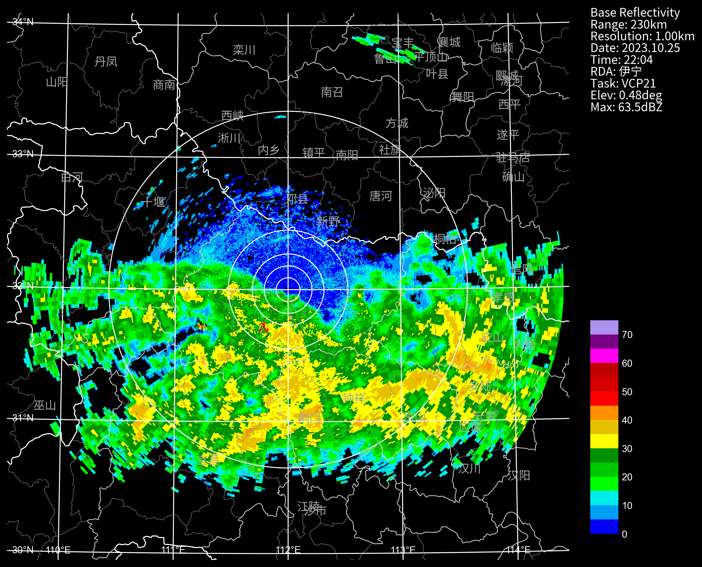
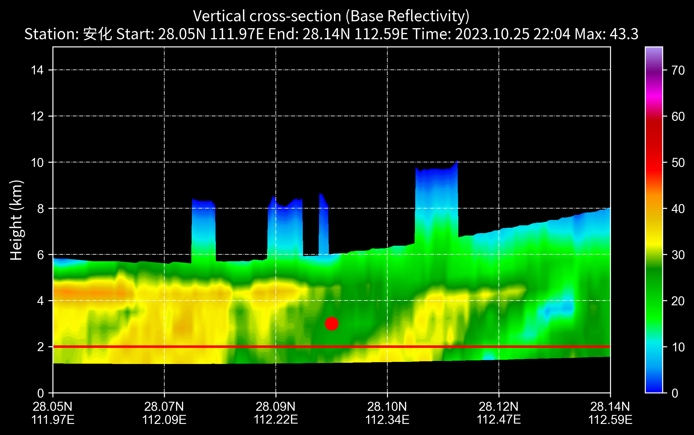
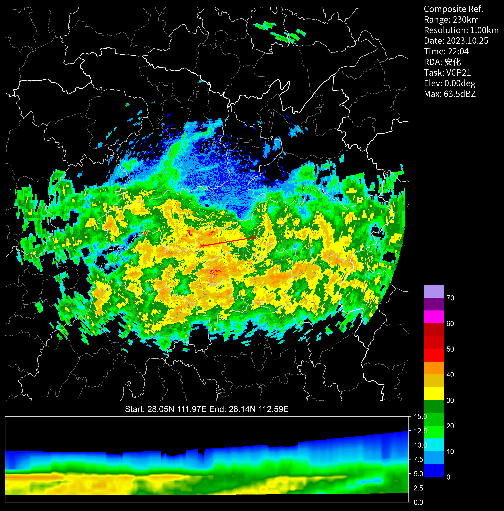
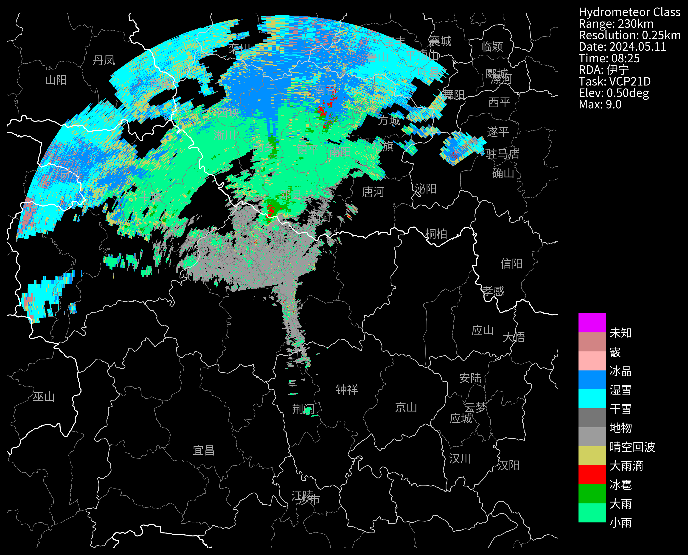

## 画图基本操作
```python
# 读取数据，这里以BR为例
nFiles = basePath + "/cinrad/bz2/Z_RADR_I_Z9737_20231025220414_O_DOR_SA_CAP_FMT.bin.bz2"
f = cinrad.io.read_auto(nFiles)

# 想把时间改成北京时？
# f.scantime = f.scantime + datetime.timedelta(hours=8)
data = f.get_data(0, 230, "REF")

# 开始画图
fig = PPI(
    data, dpi=300, style="black", add_city_names=True
)  # 背景颜色支持：white /black / transparent

# 附加操作
fig.plot_range_rings([10, 20, 30, 50, 150], color="white", linewidth=1)  # 用这个来画圈
fig.gridlines(draw_labels=True, linewidth=1, color="white")  # 用这个来画经纬度网格线

# 要在地图上画一个红色大圆点？
import cartopy.crs as ccrs

fig.geoax.scatter(
    x=112.34, y=29.22, s=500, c="r", marker=".", transform=ccrs.PlateCarree()
)

# 将图片保存
# fig("d:/")
# 或者 fig("d:/abc.png")
# 或者 imgName = fig("d:/")
```
```md
<matplotlib.collections.PathCollection at 0x2242392e4f0>
```

## 剖面图
```python
nFiles = basePath + "/cinrad/bz2c/Z_RADR_I_Z9737_20231025220414_O_DOR_SA_CAP_FMT.bin.bz2"
f = cinrad.io.read_auto(nFiles)
rl = list(f.iter_tilt(230, "REF")) #  REF,VEL,ZDR,KDP,RHO
vcs = cinrad.calc.VCS(rl)
sec = vcs.get_section(start_cart=(111.97, 28.05), end_cart=(112.59, 28.14))  # 传入经纬度坐标
# sec = vcs.get_section(start_polar=(0, 30), end_polar=(90, 30)) # 传入极坐标
fig = cinrad.visualize.Section(sec, interpolate=True) # interpolate 是否插值
plt.scatter(0.5, 3, s=100, c="red", marker="o" )  # 在x轴的0.5位置，3公里高度位置画个点
plt.axline((0, 2), (1, 2), linewidth=2, color="red")  # 在2公里高度画根线
```
```md
<matplotlib.lines.AxLine at 0x206d4b9bdc0>
```

##  在PPI图下方添加剖面图
```python
# VCS画图测试
nFiles = basePath + "/cinrad/bz2c/Z_RADR_I_Z9737_20231025220414_O_DOR_SA_CAP_FMT.bin.bz2"
f = cinrad.io.read_auto(nFiles)
rl = list(f.iter_tilt(230, "REF"))
cr = cinrad.calc.quick_cr(rl)
fig = PPI(cr, dpi=300, style="black")
fig.settings["is_inline"] = False  # notebook模式下需要这一行，正常不需要
vcs = cinrad.calc.VCS(rl)
sec = vcs.get_section(start_cart=(111.97, 28.05), end_cart=(112.59, 28.14))  # 传入经纬度坐标
# sec = vcs.get_section(start_polar=(113, 250), end_polar=(114, 28)) # 传入极坐标
fig.plot_cross_section(sec, linecolor="red")
```

## 自定义色标
Cinrad自带了很多的标准色标，一般不需要自定义；  
如果你需要使用其他色标，则可以使用下面的方法自定义一个
```python
nFiles = basePath + "/cinrad/bz2/Z_RADR_I_Z9735_20240511082558_P_DOR_SAD_HCL_250_230_5_FMT.bin"
f = cinrad.io.read_auto(nFiles)
data = f.get_data()
import matplotlib.colors as cmx
from cinrad.visualize.gpf import _cmap

cmapFile = (
    basePath + "HCL"  # 色标文件参照/data/colormap/目录下的格式，也放到这个目录下
)
cmap = _cmap(cmapFile)["cmap"]
norm = cmx.Normalize(0, 10)  # 取值区间
label = ["小雨", "大雨", "冰雹", "大雨滴", "晴空回波", "地物", "干雪", "湿雪", "冰晶", "霰", "未知",""]
fig = PPI(
    data,
    add_city_names=True,
    dpi=300,
    style="black",
    cmap=cmap,
    norm=norm,
    label=label,
)
# fig("d:/temp/")
# HCL.map文件内容如下：
"""
*NAME:HCL
*AUTHOR:CMA
*TYPE:LISTED
*UNIT:None
*UNDER:0/251/144
*OVER:231/0/255
0 0/251/144
1 0/187/0
2 255/0/0
3 208/208/96
4 156/156/156
5 118/118/118
6 0/255/255
7 0/144/255
8 255/176/176
9 210/132/132
10 231/0/255
"""
```
```md
'\n*NAME:HCL\n*AUTHOR:CMA\n*TYPE:LISTED\n*UNIT:None\n*UNDER:0/251/144\n*OVER:231/0/255\n0 0/251/144\n1 0/187/0\n2 255/0/0\n3 208/208/96\n4 156/156/156\n5 118/118/118\n6 0/255/255\n7 0/144/255\n8 255/176/176\n9 210/132/132\n10 231/0/255\n'
```

